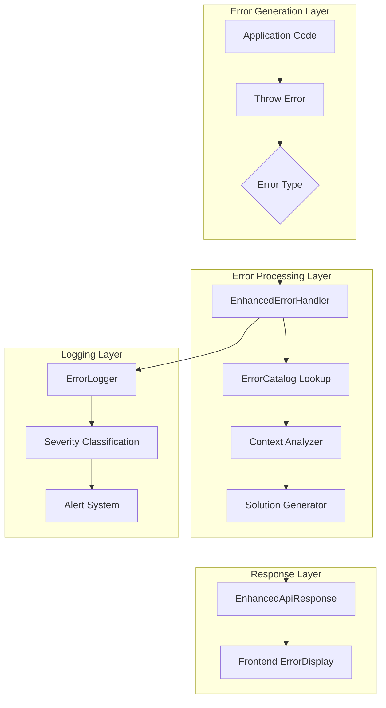

# Design Document: Enhanced Error Handling

## Overview

本设计文档描述了增强错误处理系统的架构和实现方案。该系统在现有错误处理基础上进行扩展，为每个错误提供可能的原因分析和解决方案建议，帮助用户快速理解和解决问题。

系统基于现有的 `AppError` 类层次结构和 `ApiResponse` 工具类进行扩展，保持向后兼容性的同时增加新功能。

## Architecture



## Components and Interfaces

### 1. EnhancedErrorResponse Interface

扩展现有的 `ApiErrorResponse`，增加原因和解决方案字段：

```typescript
interface ErrorCause {
  id: string
  description: string
  likelihood: 'high' | 'medium' | 'low'
}

interface ErrorSolution {
  id: string
  description: string
  actionType: 'manual' | 'automatic' | 'link'
  actionUrl?: string
  actionLabel?: string
}

interface EnhancedErrorResponse {
  success: false
  error: {
    code: string
    message: string
    causes: ErrorCause[]
    solutions: ErrorSolution[]
    context?: ErrorContext
    requestId: string
    timestamp: string
    severity: 'info' | 'warning' | 'error' | 'critical'
    documentationUrl?: string
  }
}
```

### 2. ErrorContext Interface

捕获错误发生时的上下文信息：

```typescript
interface ErrorContext {
  // 通用上下文
  userId?: string
  organizationId?: string
  
  // 工作流相关
  workflowId?: string
  executionId?: string
  nodeId?: string
  nodeType?: string
  
  // 请求相关
  endpoint?: string
  method?: string
  
  // 字段相关（用于验证错误）
  fieldErrors?: FieldError[]
}

interface FieldError {
  field: string
  value?: unknown
  constraint: string
  message: string
}
```

### 3. ErrorCatalog

集中管理错误类型及其对应的原因和解决方案：

```typescript
interface ErrorCatalogEntry {
  code: string
  category: ErrorCategory
  defaultMessage: string
  causes: ErrorCause[]
  solutions: ErrorSolution[]
  severity: ErrorSeverity
  documentationUrl?: string
}

type ErrorCategory = 
  | 'validation'
  | 'authentication'
  | 'authorization'
  | 'network'
  | 'database'
  | 'file_system'
  | 'external_service'
  | 'workflow'
  | 'internal'

type ErrorSeverity = 'info' | 'warning' | 'error' | 'critical'
```

### 4. EnhancedAppError Class

扩展现有的 `AppError` 基类：

```typescript
abstract class EnhancedAppError extends Error {
  abstract readonly code: string
  abstract readonly statusCode: number
  abstract readonly category: ErrorCategory
  readonly severity: ErrorSeverity = 'error'
  readonly context?: ErrorContext
  readonly causes: ErrorCause[] = []
  readonly solutions: ErrorSolution[] = []
  
  constructor(
    message: string,
    options?: {
      context?: ErrorContext
      causes?: ErrorCause[]
      solutions?: ErrorSolution[]
    }
  )
  
  toEnhancedJSON(): EnhancedErrorResponse
}
```

### 5. Specialized Error Classes

针对不同场景的专用错误类：

```typescript
// 数据库错误
class DatabaseError extends EnhancedAppError {
  readonly category = 'database'
  readonly dbErrorType: 'connection' | 'constraint' | 'timeout' | 'query'
  readonly constraintType?: 'unique' | 'foreign_key' | 'check' | 'not_null'
  readonly affectedField?: string
}

// 外部服务错误
class ExternalServiceError extends EnhancedAppError {
  readonly category = 'external_service'
  readonly serviceName: string
  readonly isTemporary: boolean
  readonly retryAfter?: number
}

// 文件操作错误
class FileOperationError extends EnhancedAppError {
  readonly category = 'file_system'
  readonly fileErrorType: 'size' | 'type' | 'permission' | 'not_found' | 'corrupted'
  readonly maxSize?: number
  readonly allowedTypes?: string[]
}

// 工作流执行错误
class WorkflowExecutionError extends EnhancedAppError {
  readonly category = 'workflow'
  readonly nodeId: string
  readonly nodeType: string
  readonly executionId: string
  readonly inputField?: string
}
```

### 6. EnhancedApiResponse Class

扩展现有的 `ApiResponse` 类：

```typescript
class EnhancedApiResponse extends ApiResponse {
  static enhancedError(
    error: EnhancedAppError,
    requestId?: string
  ): NextResponse<EnhancedErrorResponse>
  
  static fromError(
    error: unknown,
    requestId?: string
  ): NextResponse<EnhancedErrorResponse>
}
```

### 7. ErrorDisplay Component

前端错误展示组件：

```typescript
interface ErrorDisplayProps {
  error: EnhancedErrorResponse['error']
  onRetry?: () => void
  onDismiss?: () => void
  showDetails?: boolean
}
```

## Data Models

### ErrorCatalog 数据结构

```typescript
const ERROR_CATALOG: Record<string, ErrorCatalogEntry> = {
  // 验证错误
  'VALIDATION_ERROR': {
    code: 'VALIDATION_ERROR',
    category: 'validation',
    defaultMessage: '请求参数验证失败',
    causes: [
      { id: 'invalid_format', description: '输入格式不正确', likelihood: 'high' },
      { id: 'missing_required', description: '缺少必填字段', likelihood: 'high' },
      { id: 'value_out_of_range', description: '值超出允许范围', likelihood: 'medium' },
    ],
    solutions: [
      { id: 'check_format', description: '检查输入格式是否符合要求', actionType: 'manual' },
      { id: 'fill_required', description: '填写所有必填字段', actionType: 'manual' },
      { id: 'view_docs', description: '查看 API 文档了解参数要求', actionType: 'link', actionUrl: '/docs/api' },
    ],
    severity: 'warning',
  },
  
  // 认证错误
  'AUTHENTICATION_ERROR': {
    code: 'AUTHENTICATION_ERROR',
    category: 'authentication',
    defaultMessage: '认证失败',
    causes: [
      { id: 'invalid_credentials', description: '用户名或密码错误', likelihood: 'high' },
      { id: 'session_expired', description: '登录会话已过期', likelihood: 'high' },
      { id: 'token_invalid', description: '访问令牌无效', likelihood: 'medium' },
    ],
    solutions: [
      { id: 'relogin', description: '重新登录', actionType: 'link', actionUrl: '/login', actionLabel: '去登录' },
      { id: 'check_credentials', description: '检查用户名和密码是否正确', actionType: 'manual' },
      { id: 'reset_password', description: '如果忘记密码，可以重置', actionType: 'link', actionUrl: '/reset-password' },
    ],
    severity: 'warning',
  },
  
  // 数据库连接错误
  'DATABASE_CONNECTION_ERROR': {
    code: 'DATABASE_CONNECTION_ERROR',
    category: 'database',
    defaultMessage: '数据库连接失败',
    causes: [
      { id: 'db_down', description: '数据库服务不可用', likelihood: 'high' },
      { id: 'network_issue', description: '网络连接问题', likelihood: 'medium' },
      { id: 'config_error', description: '数据库配置错误', likelihood: 'low' },
    ],
    solutions: [
      { id: 'retry', description: '稍后重试', actionType: 'automatic', actionLabel: '重试' },
      { id: 'check_status', description: '检查系统状态页面', actionType: 'link', actionUrl: '/status' },
      { id: 'contact_support', description: '如果问题持续，请联系技术支持', actionType: 'link', actionUrl: '/support' },
    ],
    severity: 'critical',
  },
  
  // 更多错误类型...
}
```

## Correctness Properties

*A property is a characteristic or behavior that should hold true across all valid executions of a system-essentially, a formal statement about what the system should do. Properties serve as the bridge between human-readable specifications and machine-verifiable correctness guarantees.*

### Property 1: Error Response Structure Completeness

*For any* error thrown in the system, the enhanced error response SHALL contain all required fields: code (non-empty string), message (non-empty string), causes (array), solutions (array), requestId (non-empty string), timestamp (valid ISO string), and severity (valid enum value).

**Validates: Requirements 1.1, 1.2, 1.3, 1.4, 1.5**

### Property 2: Error Catalog Coverage

*For any* error code defined in the system, there SHALL exist a corresponding entry in the ErrorCatalog with at least one cause and one solution.

**Validates: Requirements 2.3, 2.4**

### Property 3: HTTP Status Code Mapping

*For any* error type, the HTTP status code returned SHALL match the expected status code for that error category (e.g., validation errors → 400, auth errors → 401/403, not found → 404, internal → 500).

**Validates: Requirements 3.2**

### Property 4: Validation Error Field Details

*For any* validation error with field-specific issues, the error response SHALL include a fieldErrors array where each entry contains the field name and constraint that was violated.

**Validates: Requirements 3.3**

### Property 5: Workflow Error Context

*For any* workflow execution error, the error response context SHALL include nodeId, nodeType, and executionId fields with non-empty values.

**Validates: Requirements 5.1, 5.2**

### Property 6: Database Error Type Identification

*For any* database error, the error response SHALL correctly identify the error type (connection, constraint, timeout, query) based on the underlying database error.

**Validates: Requirements 6.1**

### Property 7: External Service Error Handling

*For any* external service error, the error response SHALL include serviceName (non-empty), isTemporary (boolean), and if isTemporary is true, SHALL include retryAfter suggestion.

**Validates: Requirements 7.1, 7.2, 7.3, 7.4**

### Property 8: File Error Details

*For any* file operation error, the error response SHALL include the specific error type and relevant limits (maxSize for size errors, allowedTypes for type errors).

**Validates: Requirements 8.1, 8.2, 8.3**

### Property 9: Auth Error Security

*For any* authentication or authorization error, the error response SHALL NOT include sensitive information such as password hashes, internal user IDs, or security tokens, while still providing the required permission name for authorization errors.

**Validates: Requirements 9.1, 9.3, 9.4**

### Property 10: Sensitive Data Masking

*For any* error that contains potentially sensitive data (emails, API keys, passwords, tokens), the error response SHALL mask this data using appropriate patterns (e.g., "a]***@example.com", "sk-***...***").

**Validates: Requirements 1.6**

### Property 11: Error Severity Classification

*For any* error in the system, it SHALL be assigned a severity level from the set {info, warning, error, critical} based on its category and impact.

**Validates: Requirements 10.3**

## Error Handling

### Error Processing Flow

1. **捕获阶段**: 在 try-catch 块中捕获错误
2. **识别阶段**: 判断错误类型，查找 ErrorCatalog
3. **增强阶段**: 添加上下文、原因和解决方案
4. **脱敏阶段**: 移除或掩码敏感信息
5. **响应阶段**: 构建标准化响应
6. **日志阶段**: 记录完整错误信息

### Error Handler Middleware

```typescript
async function errorHandler(
  error: unknown,
  request: NextRequest
): Promise<NextResponse<EnhancedErrorResponse>> {
  const requestId = generateRequestId()
  
  // 1. 转换为 EnhancedAppError
  const enhancedError = normalizeError(error)
  
  // 2. 查找目录获取原因和解决方案
  const catalogEntry = ERROR_CATALOG[enhancedError.code]
  if (catalogEntry) {
    enhancedError.causes = catalogEntry.causes
    enhancedError.solutions = catalogEntry.solutions
  }
  
  // 3. 脱敏处理
  const sanitizedError = sanitizeError(enhancedError)
  
  // 4. 记录日志
  await logError(sanitizedError, requestId, request)
  
  // 5. 返回响应
  return EnhancedApiResponse.enhancedError(sanitizedError, requestId)
}
```

## Testing Strategy

### Unit Tests

- 测试每个错误类的实例化和属性
- 测试 ErrorCatalog 的查找功能
- 测试敏感数据脱敏功能
- 测试错误响应格式化

### Property-Based Tests

使用 fast-check 库进行属性测试：

- **Property 1**: 生成随机错误，验证响应结构完整性
- **Property 2**: 遍历所有错误代码，验证目录覆盖
- **Property 3**: 生成各类错误，验证 HTTP 状态码映射
- **Property 4**: 生成验证错误，验证字段详情
- **Property 5**: 生成工作流错误，验证上下文字段
- **Property 6**: 生成数据库错误，验证类型识别
- **Property 7**: 生成外部服务错误，验证处理逻辑
- **Property 8**: 生成文件错误，验证详情字段
- **Property 9**: 生成认证错误，验证无敏感信息泄露
- **Property 10**: 生成含敏感数据的错误，验证脱敏
- **Property 11**: 生成各类错误，验证严重级别分配

### Integration Tests

- 测试 API 端点的错误响应
- 测试前端组件的错误展示
- 测试错误日志记录

### Test Configuration

- 使用 Vitest 作为测试框架
- 使用 fast-check 进行属性测试
- 每个属性测试至少运行 100 次迭代
