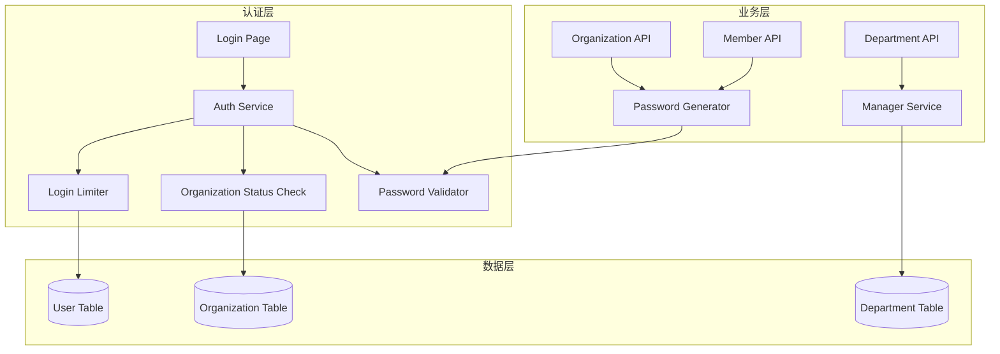

# Design Document: Enterprise User Flow Enhancement

## Overview

本设计文档描述企业账号管理用户流程的安全性和功能性改进方案。主要包括：密码安全增强、企业状态验证、登录失败锁定、统一密码验证、部门负责人管理、成员角色完善等功能。

## Architecture

### 系统架构图



## Components and Interfaces

### 1. Password Validator (`src/lib/auth/password-validator.ts`)

统一的密码强度验证器，用于所有密码设置场景。

```typescript
interface PasswordValidationResult {
  isValid: boolean;
  errors: string[];
  strength: 'weak' | 'medium' | 'strong';
}

interface PasswordRequirements {
  minLength: number;
  requireUppercase: boolean;
  requireLowercase: boolean;
  requireNumber: boolean;
  requireSpecialChar: boolean;
  specialChars: string;
}

// 默认要求
const DEFAULT_REQUIREMENTS: PasswordRequirements = {
  minLength: 12,
  requireUppercase: true,
  requireLowercase: true,
  requireNumber: true,
  requireSpecialChar: true,
  specialChars: '!@#$%^&*()_+-=[]{}|;:,.<>?'
};

function validatePassword(password: string, requirements?: PasswordRequirements): PasswordValidationResult;
function generateSecurePassword(length?: number): string;
```

### 2. Login Limiter (`src/lib/auth/login-limiter.ts`)

登录失败限制器，防止暴力破解攻击。

```typescript
interface LoginAttemptResult {
  allowed: boolean;
  remainingAttempts: number;
  lockedUntil?: Date;
  lockRemainingSeconds?: number;
}

const LOGIN_CONFIG = {
  maxAttempts: 5,
  lockDurationMinutes: 30
};

async function checkLoginAllowed(userId: string): Promise<LoginAttemptResult>;
async function recordFailedAttempt(userId: string): Promise<void>;
async function resetLoginAttempts(userId: string): Promise<void>;
```

### 3. Organization Status Checker

在认证流程中检查企业状态。

```typescript
interface OrgStatusCheckResult {
  allowed: boolean;
  status: OrgStatus;
  message?: string;
}

const STATUS_MESSAGES: Record<OrgStatus, string> = {
  PENDING: '您的企业账号正在审核中',
  SUSPENDED: '您的企业账号已被暂停，请联系管理员',
  DISABLED: '您的企业账号已被禁用',
  ACTIVE: ''
};

async function checkOrganizationStatus(organizationId: string): Promise<OrgStatusCheckResult>;
```

### 4. Department Manager Service

部门负责人管理服务。

```typescript
interface DepartmentWithManager {
  id: string;
  name: string;
  managerId: string | null;
  manager?: {
    id: string;
    name: string;
    email: string;
  };
}

async function setDepartmentManager(departmentId: string, managerId: string | null): Promise<void>;
async function clearManagerFromDepartments(userId: string): Promise<void>;
```

## Data Models

### User Model 扩展

需要在 User 模型中添加登录限制相关字段：

```prisma
model User {
  // ... 现有字段 ...
  loginAttempts    Int       @default(0)
  lockedUntil      DateTime?
}
```

### 数据库迁移

```sql
ALTER TABLE users ADD COLUMN loginAttempts INT DEFAULT 0;
ALTER TABLE users ADD COLUMN lockedUntil DATETIME NULL;
```

## Correctness Properties

*A property is a characteristic or behavior that should hold true across all valid executions of a system-essentially, a formal statement about what the system should do. Properties serve as the bridge between human-readable specifications and machine-verifiable correctness guarantees.*

### Property 1: Password Validation Completeness

*For any* password string, the Password_Validator SHALL correctly identify whether it meets all requirements: minimum 12 characters, at least one uppercase letter, at least one lowercase letter, at least one number, and at least one special character.

**Validates: Requirements 4.1, 4.2, 4.3, 4.4, 4.5**

### Property 2: Secure Password Generation

*For any* generated password from `generateSecurePassword()`, the password SHALL pass validation by `validatePassword()` with the default requirements.

**Validates: Requirements 1.2, 7.1**

### Property 3: Organization Status Blocking

*For any* user belonging to an organization with status PENDING, SUSPENDED, or DISABLED, the login attempt SHALL be blocked with the appropriate error message.

**Validates: Requirements 2.1, 2.2, 2.3, 2.4, 2.5**

### Property 4: Login Attempt Tracking

*For any* user, after exactly 5 consecutive failed login attempts, the account SHALL be locked for 30 minutes, and the `lockedUntil` timestamp SHALL be set correctly.

**Validates: Requirements 3.1, 3.2, 3.3, 3.4**

### Property 5: Must Change Password Flag

*For any* newly created organization owner or member, the `mustChangePassword` flag SHALL be set to `true`.

**Validates: Requirements 1.1, 7.3**

### Property 6: Manager Cleanup on Member Removal

*For any* member who is a department manager, when that member is removed from the organization, all departments where they are the manager SHALL have their `managerId` set to `null`.

**Validates: Requirements 5.4**

## Error Handling

### 认证错误

| 错误场景 | 错误码 | 用户提示 |
|---------|-------|---------|
| 企业审核中 | ORG_PENDING | 您的企业账号正在审核中 |
| 企业已暂停 | ORG_SUSPENDED | 您的企业账号已被暂停，请联系管理员 |
| 企业已禁用 | ORG_DISABLED | 您的企业账号已被禁用 |
| 账户已锁定 | ACCOUNT_LOCKED | 账户已锁定，请在 {minutes} 分钟后重试 |
| 密码强度不足 | WEAK_PASSWORD | 密码不符合安全要求：{details} |

### 业务错误

| 错误场景 | 错误码 | 用户提示 |
|---------|-------|---------|
| 部门负责人不存在 | MANAGER_NOT_FOUND | 指定的负责人不存在 |
| 负责人不在企业中 | MANAGER_NOT_IN_ORG | 负责人必须是企业成员 |

## Testing Strategy

### 单元测试

使用 Vitest 进行单元测试，覆盖以下场景：

1. **Password Validator Tests**
   - 测试各种密码组合的验证结果
   - 测试边界条件（刚好满足/不满足要求）
   - 测试特殊字符识别

2. **Login Limiter Tests**
   - 测试失败计数递增
   - 测试成功登录重置计数
   - 测试锁定触发条件
   - 测试锁定过期

3. **Organization Status Tests**
   - 测试各种状态的检查结果
   - 测试错误消息正确性

### 属性测试

使用 fast-check 进行属性测试，每个属性测试运行至少 100 次迭代。

```typescript
// 示例：密码验证属性测试
import fc from 'fast-check';

describe('Password Validator Properties', () => {
  // Feature: enterprise-user-flow, Property 1: Password Validation Completeness
  it('should correctly validate password requirements', () => {
    fc.assert(
      fc.property(fc.string(), (password) => {
        const result = validatePassword(password);
        // 验证结果与手动检查一致
        const hasMinLength = password.length >= 12;
        const hasUppercase = /[A-Z]/.test(password);
        const hasLowercase = /[a-z]/.test(password);
        const hasNumber = /[0-9]/.test(password);
        const hasSpecial = /[!@#$%^&*()_+\-=\[\]{}|;:,.<>?]/.test(password);
        
        const shouldBeValid = hasMinLength && hasUppercase && hasLowercase && hasNumber && hasSpecial;
        return result.isValid === shouldBeValid;
      }),
      { numRuns: 100 }
    );
  });

  // Feature: enterprise-user-flow, Property 2: Secure Password Generation
  it('generated passwords should always pass validation', () => {
    fc.assert(
      fc.property(fc.integer({ min: 12, max: 32 }), (length) => {
        const password = generateSecurePassword(length);
        const result = validatePassword(password);
        return result.isValid === true;
      }),
      { numRuns: 100 }
    );
  });
});
```

### 集成测试

1. **认证流程集成测试**
   - 测试完整的登录流程（包括状态检查、锁定检查）
   - 测试首次登录强制修改密码流程

2. **成员管理集成测试**
   - 测试创建成员时密码生成和 mustChangePassword 设置
   - 测试删除成员时部门负责人清理

### 测试配置

```typescript
// vitest.config.ts
export default defineConfig({
  test: {
    globals: true,
    environment: 'node',
    coverage: {
      provider: 'v8',
      reporter: ['text', 'json', 'html'],
      include: ['src/lib/auth/**/*.ts'],
    },
  },
});
```
