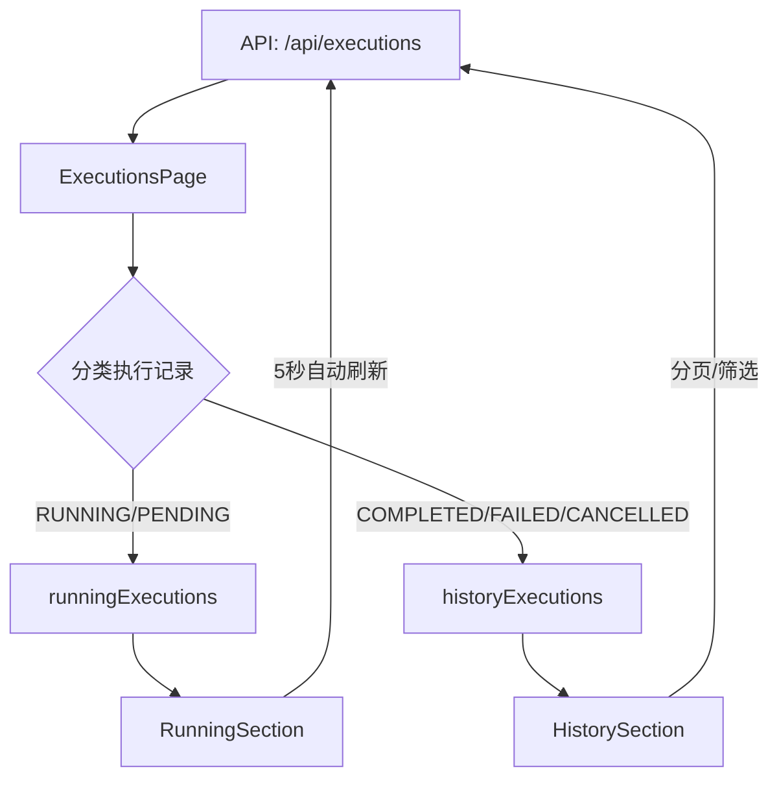

# Design Document: Execution History Categories

## Overview

本设计文档描述如何将执行历史页面重构为两个分类区域：正在执行（Running）和历史记录（History）。通过分离活跃执行和已完成执行，用户可以更高效地监控工作流状态。

## Architecture

### 组件结构

```
ExecutionsPage
├── PageHeader (标题、刷新按钮)
├── RunningSection (正在执行区域)
│   ├── SectionHeader (标题、运行数量指示器)
│   └── RunningExecutionList
│       └── RunningExecutionCard[] (卡片式展示)
├── HistorySection (历史记录区域)
│   ├── SectionHeader (标题)
│   ├── FilterBar (筛选栏)
│   ├── HistoryTable (表格展示)
│   └── Pagination (分页)
```

### 数据流



## Components and Interfaces

### 类型定义

```typescript
// 执行状态类型
type ExecutionStatus = 'PENDING' | 'RUNNING' | 'COMPLETED' | 'FAILED' | 'CANCELLED'

// 执行记录接口
interface Execution {
  id: string
  status: ExecutionStatus
  workflowId: string
  workflowName: string
  startedAt: string | null
  completedAt: string | null
  createdAt: string
  duration: number | null
  totalTokens: number
  error: string | null
  outputFileCount: number
}

// 分类结果接口
interface CategorizedExecutions {
  running: Execution[]  // RUNNING 或 PENDING 状态
  history: Execution[]  // COMPLETED、FAILED 或 CANCELLED 状态
}

// 筛选参数接口
interface HistoryFilters {
  workflowId?: string
  status?: 'COMPLETED' | 'FAILED' | 'CANCELLED'
  startDate?: string
  endDate?: string
}
```

### 核心函数

```typescript
/**
 * 将执行记录分类为运行中和历史记录
 * @param executions 所有执行记录
 * @returns 分类后的执行记录
 */
function categorizeExecutions(executions: Execution[]): CategorizedExecutions {
  const running: Execution[] = []
  const history: Execution[] = []
  
  for (const execution of executions) {
    if (execution.status === 'RUNNING' || execution.status === 'PENDING') {
      running.push(execution)
    } else {
      history.push(execution)
    }
  }
  
  return { running, history }
}

/**
 * 检查执行记录是否为运行中状态
 * @param execution 执行记录
 * @returns 是否为运行中
 */
function isRunningExecution(execution: Execution): boolean {
  return execution.status === 'RUNNING' || execution.status === 'PENDING'
}

/**
 * 计算执行的已用时间（毫秒）
 * @param execution 执行记录
 * @returns 已用时间
 */
function calculateElapsedTime(execution: Execution): number {
  if (!execution.startedAt) return 0
  const startTime = new Date(execution.startedAt).getTime()
  const endTime = execution.completedAt 
    ? new Date(execution.completedAt).getTime() 
    : Date.now()
  return endTime - startTime
}
```

## Data Models

### API 响应结构

现有 API `/api/executions` 已支持所需数据，无需修改后端。前端将负责分类逻辑。

```typescript
// API 响应
interface ExecutionsResponse {
  success: boolean
  data: {
    executions: Execution[]
    total: number
    limit: number
    offset: number
  }
}
```

### 状态管理

```typescript
// 页面状态
interface PageState {
  // 运行中的执行记录（独立获取，自动刷新）
  runningExecutions: Execution[]
  runningCount: number
  
  // 历史记录（分页获取）
  historyExecutions: Execution[]
  historyTotal: number
  historyPage: number
  
  // 筛选状态
  filters: HistoryFilters
  
  // 加载状态
  isLoadingRunning: boolean
  isLoadingHistory: boolean
}
```

## Correctness Properties

*A property is a characteristic or behavior that should hold true across all valid executions of a system-essentially, a formal statement about what the system should do. Properties serve as the bridge between human-readable specifications and machine-verifiable correctness guarantees.*

### Property 1: Execution Categorization Completeness

*For any* list of executions, categorizing them into running and history sections SHALL result in every execution appearing in exactly one section, with no executions lost or duplicated.

**Validates: Requirements 1.2, 1.3, 2.2**

### Property 2: Running Section Contains Only Active Executions

*For any* execution in the Running_Section, its status SHALL be either 'RUNNING' or 'PENDING'.

**Validates: Requirements 1.2**

### Property 3: History Section Contains Only Completed Executions

*For any* execution in the History_Section, its status SHALL be one of 'COMPLETED', 'FAILED', or 'CANCELLED'.

**Validates: Requirements 1.3**

### Property 4: Running Count Accuracy

*For any* list of executions, the displayed running count SHALL equal the number of executions with status 'RUNNING' or 'PENDING'.

**Validates: Requirements 1.5**

### Property 5: Filter Correctness

*For any* filter combination applied to history executions, all returned records SHALL match all specified filter criteria.

**Validates: Requirements 3.2, 3.3**

### Property 6: Pagination Correctness

*For any* page number and page size, the history section SHALL display at most pageSize records, and the total count SHALL reflect all matching records.

**Validates: Requirements 3.1**

### Property 7: Status Icon Mapping

*For any* execution status, the rendered icon SHALL correspond to the correct status type (animated for running, static for completed).

**Validates: Requirements 4.3**

## Error Handling

| 场景 | 处理方式 |
|------|----------|
| API 请求失败 | 显示错误提示，保留上次数据，允许重试 |
| 运行区域加载失败 | 显示错误状态，不影响历史区域 |
| 历史区域加载失败 | 显示错误状态，不影响运行区域 |
| 无运行中的执行 | 隐藏运行区域或显示空状态 |
| 无历史记录 | 显示空状态提示 |

## Testing Strategy

### 单元测试

使用 Vitest 进行单元测试：

1. `categorizeExecutions` 函数测试
   - 测试空数组输入
   - 测试只有运行中记录
   - 测试只有历史记录
   - 测试混合记录

2. `isRunningExecution` 函数测试
   - 测试各种状态的判断

3. `calculateElapsedTime` 函数测试
   - 测试正在运行的执行
   - 测试已完成的执行
   - 测试无开始时间的执行

### 属性测试

使用 fast-check 进行属性测试，每个属性测试运行至少 100 次迭代：

```typescript
// 示例：Property 1 - 分类完整性
// Feature: execution-history-categories, Property 1: Execution Categorization Completeness
fc.assert(
  fc.property(
    fc.array(arbitraryExecution),
    (executions) => {
      const { running, history } = categorizeExecutions(executions)
      return running.length + history.length === executions.length
    }
  ),
  { numRuns: 100 }
)
```

### 测试覆盖

| 属性 | 测试类型 | 验证内容 |
|------|----------|----------|
| Property 1 | 属性测试 | 分类完整性 |
| Property 2 | 属性测试 | 运行区域状态过滤 |
| Property 3 | 属性测试 | 历史区域状态过滤 |
| Property 4 | 属性测试 | 运行数量准确性 |
| Property 5 | 属性测试 | 筛选正确性 |
| Property 6 | 属性测试 | 分页正确性 |
| Property 7 | 单元测试 | 状态图标映射 |
