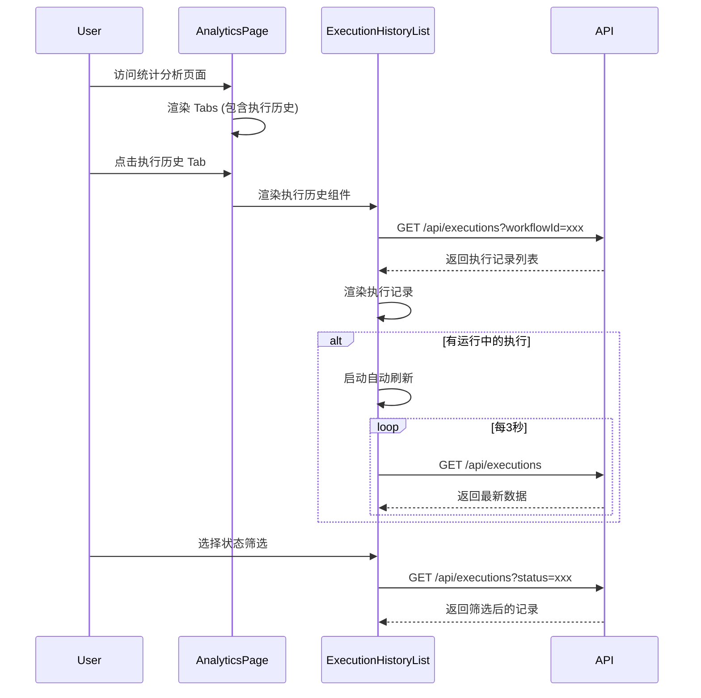

# Design Document

## Overview

本设计文档描述如何将工作流执行历史从独立的侧边栏面板整合到统计分析页面中。通过在统计分析页面新增"执行历史"Tab，用户可以在一个页面集中查看所有执行相关的数据和分析。同时移除工作流编辑器中的执行历史按钮和面板，简化界面。

## Architecture

### 组件结构

```
src/app/(editor)/workflows/[id]/analytics/page.tsx  (修改)
├── Tabs
│   ├── 执行统计 (现有)
│   ├── 节点分析 (现有)
│   ├── 测试反馈 (现有)
│   ├── 成本分析 (现有)
│   ├── 执行历史 (新增) ← 整合执行历史功能
│   └── 数据分析 (现有)

src/components/workflow/analytics/execution-history-list.tsx (新建)
├── 状态筛选器
├── 执行记录列表
│   ├── 执行记录卡片
│   │   ├── 状态图标
│   │   ├── 基本信息 (耗时、Token、时间)
│   │   └── 展开详情
│   └── 加载更多按钮
└── 空状态提示

src/app/(editor)/workflows/[id]/page.tsx (修改)
└── 移除 ExecutionHistoryPanel 相关代码
```

### 数据流



## Components and Interfaces

### ExecutionHistoryList 组件

```typescript
interface ExecutionHistoryListProps {
  workflowId: string
  period: string  // 时间周期，与页面选择器联动
}

interface Execution {
  id: string
  status: 'PENDING' | 'RUNNING' | 'COMPLETED' | 'FAILED'
  duration: number | null
  totalTokens: number | null
  error: string | null
  createdAt: string
  completedAt: string | null
}

interface ExecutionHistoryListState {
  executions: Execution[]
  isLoading: boolean
  error: string | null
  statusFilter: 'all' | 'COMPLETED' | 'FAILED' | 'RUNNING' | 'PENDING'
  selectedExecutionId: string | null
  hasMore: boolean
  page: number
}
```

### API 接口

使用现有的 `/api/executions` 接口：

```typescript
// GET /api/executions
interface ExecutionsQueryParams {
  workflowId: string
  status?: 'PENDING' | 'RUNNING' | 'COMPLETED' | 'FAILED'
  limit?: number
  offset?: number
  startDate?: string  // ISO 日期字符串
  endDate?: string    // ISO 日期字符串
}

interface ExecutionsResponse {
  success: boolean
  data: {
    executions: Execution[]
    total: number
    hasMore: boolean
  }
}
```

## Data Models

使用现有的 `Execution` 数据模型，无需修改数据库 schema。

## Correctness Properties

*A property is a characteristic or behavior that should hold true across all valid executions of a system-essentially, a formal statement about what the system should do. Properties serve as the bridge between human-readable specifications and machine-verifiable correctness guarantees.*

### Property 1: 执行记录列表渲染完整性

*For any* 执行记录列表，渲染后的每条记录应包含状态、耗时、Token 消耗、创建时间，且如果记录有错误信息则应显示错误信息。

**Validates: Requirements 1.2, 1.5, 3.3**

### Property 2: 状态筛选正确性

*For any* 执行记录列表和状态筛选条件，筛选后的结果应只包含符合该状态条件的记录。当筛选条件为"全部"时，应返回所有记录。

**Validates: Requirements 1.4**

### Property 3: 时间范围筛选正确性

*For any* 执行记录列表和时间范围筛选条件，筛选后的所有执行记录的创建时间应都在该时间范围内。

**Validates: Requirements 4.2**

### Property 4: 详情链接生成正确性

*For any* 执行记录，生成的详情页链接应为 `/executions/{executionId}` 格式，其中 executionId 与记录 ID 一致。

**Validates: Requirements 1.7**

## Error Handling

1. **API 请求失败**: 显示错误提示，提供重试按钮
2. **空数据**: 显示友好的空状态提示
3. **加载状态**: 显示加载动画
4. **自动刷新失败**: 静默失败，不影响已显示的数据

## Testing Strategy

### 单元测试

1. ExecutionHistoryList 组件渲染测试
2. 状态筛选逻辑测试
3. 时间范围筛选逻辑测试
4. 详情链接生成测试
5. 空状态显示测试

### 属性测试

使用 Vitest 和 fast-check 进行属性测试：

1. **Property 1**: 生成随机执行记录列表，验证渲染后包含所有必要字段
2. **Property 2**: 生成随机执行记录和状态筛选条件，验证筛选结果正确性
3. **Property 3**: 生成随机执行记录和时间范围，验证筛选结果都在范围内
4. **Property 4**: 生成随机执行记录 ID，验证链接格式正确

### 测试配置

- 每个属性测试运行 100 次迭代
- 使用 fast-check 生成测试数据
- 测试标签格式: **Feature: execution-history-integration, Property {number}: {property_text}**
