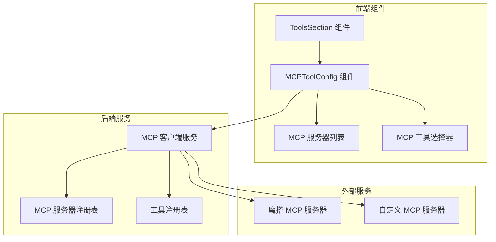
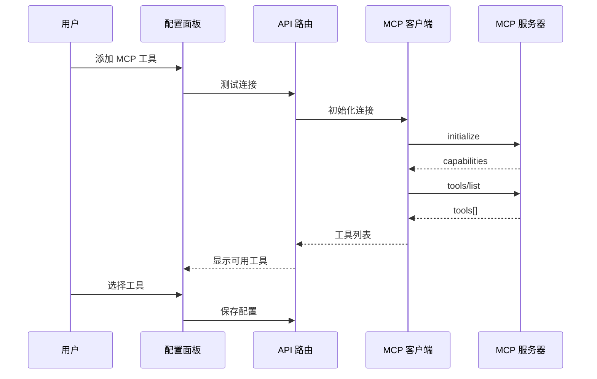

# Design Document: MCP Tool Integration

## Overview

本设计文档描述了在工作流节点配置面板中集成 MCP（Model Context Protocol）服务器配置和调用能力的技术方案。MCP 是一种开放标准协议，允许 AI 应用与外部数据源和工具进行标准化集成。

本功能将在现有的工具配置系统（`tools-section.tsx`）中添加新的 MCP 工具类型，并实现完整的 MCP 客户端功能，包括服务器连接、工具发现、工具调用等。

## Architecture

### 系统架构图



### 数据流图



## Components and Interfaces


### 1. 前端组件

#### 1.1 MCPToolConfig 组件

新增 MCP 工具配置组件，位于 `src/components/workflow/node-config-panel/shared/mcp-tool-config.tsx`

```typescript
interface MCPServerConfig {
  id: string
  name: string
  url: string
  transport: 'sse' | 'http'
  authType: 'none' | 'api-key' | 'bearer'
  apiKey?: string
  headers?: Record<string, string>
  timeout?: number
}

interface MCPToolConfig {
  serverId: string
  toolName: string
  toolDescription: string
  inputSchema: JSONSchema
  parameters: Record<string, unknown>
}

interface MCPToolConfigProps {
  config: Record<string, unknown>
  onConfigChange: (updates: Record<string, unknown>) => void
}
```

#### 1.2 工具类型扩展

在 `tools-section.tsx` 中添加新的工具类型：

```typescript
export type ToolType =
  | "http-request"
  | "code-execution"
  // ... 现有类型
  | "mcp-server"  // 新增 MCP 服务器类型
  | "mcp-modelscope"  // 魔搭 MCP 预设
  | "custom"
```

### 2. 后端服务

#### 2.1 MCP 客户端服务

新增 MCP 客户端服务，位于 `src/lib/mcp/client.ts`

```typescript
interface MCPClient {
  connect(config: MCPServerConfig): Promise<MCPConnection>
  disconnect(connectionId: string): Promise<void>
  listTools(connectionId: string): Promise<MCPTool[]>
  callTool(connectionId: string, toolName: string, args: unknown): Promise<MCPToolResult>
}

interface MCPConnection {
  id: string
  serverInfo: MCPServerInfo
  capabilities: MCPCapabilities
  status: 'connected' | 'disconnected' | 'error'
}

interface MCPTool {
  name: string
  description: string
  inputSchema: JSONSchema
}

interface MCPToolResult {
  content: MCPContent[]
  isError?: boolean
}
```

#### 2.2 MCP 工具执行器

新增 MCP 工具执行器，位于 `src/lib/ai/function-calling/executors/mcp.ts`

```typescript
class MCPToolExecutor implements ToolExecutor {
  name = 'mcp_tool'
  
  async execute(args: MCPToolArgs, context: ToolExecutionContext): Promise<ToolCallResult>
  getDefinition(): ToolDefinition
}
```

### 3. API 路由

#### 3.1 MCP 服务器管理 API

- `POST /api/mcp/servers` - 添加 MCP 服务器配置
- `GET /api/mcp/servers` - 获取已配置的服务器列表
- `DELETE /api/mcp/servers/[id]` - 删除服务器配置
- `POST /api/mcp/servers/[id]/test` - 测试服务器连接
- `GET /api/mcp/servers/[id]/tools` - 获取服务器工具列表

#### 3.2 MCP 工具调用 API

- `POST /api/mcp/tools/call` - 调用 MCP 工具


## Data Models

### 1. MCP 服务器配置模型

```typescript
interface MCPServerConfig {
  id: string                    // 唯一标识符
  name: string                  // 显示名称
  url: string                   // 服务器 URL
  transport: 'sse' | 'http'     // 传输协议
  authType: 'none' | 'api-key' | 'bearer'  // 认证类型
  apiKey?: string               // API 密钥（加密存储）
  headers?: Record<string, string>  // 自定义请求头
  timeout?: number              // 超时时间（毫秒）
  isPreset?: boolean            // 是否为预设配置
  presetType?: 'modelscope'     // 预设类型
  createdAt: Date
  updatedAt: Date
}
```

### 2. MCP 工具配置模型

```typescript
interface MCPToolNodeConfig {
  // 服务器配置
  mcpServer: MCPServerConfig
  
  // 选中的工具
  selectedTools: Array<{
    name: string
    enabled: boolean
    parameterMappings: Record<string, string | VariableRef>
  }>
  
  // 执行配置
  retryOnError: boolean
  maxRetries: number
  timeoutMs: number
}
```

### 3. MCP 协议消息模型

```typescript
// JSON-RPC 2.0 请求
interface MCPRequest {
  jsonrpc: '2.0'
  id: string | number
  method: string
  params?: unknown
}

// JSON-RPC 2.0 响应
interface MCPResponse {
  jsonrpc: '2.0'
  id: string | number
  result?: unknown
  error?: {
    code: number
    message: string
    data?: unknown
  }
}

// MCP 工具定义
interface MCPToolDefinition {
  name: string
  description?: string
  inputSchema: {
    type: 'object'
    properties?: Record<string, JSONSchema>
    required?: string[]
  }
}

// MCP 工具调用结果
interface MCPToolCallResult {
  content: Array<{
    type: 'text' | 'image' | 'resource'
    text?: string
    data?: string
    mimeType?: string
  }>
  isError?: boolean
}
```

### 4. 魔搭 MCP 预设配置

```typescript
const MODELSCOPE_MCP_PRESETS = {
  fetch: {
    name: '网页内容抓取',
    url: 'https://mcp.modelscope.cn/servers/fetch',
    description: '抓取网页内容并转换为 Markdown 格式',
    tools: ['fetch']
  },
  search: {
    name: '网络搜索',
    url: 'https://mcp.modelscope.cn/servers/search',
    description: '搜索互联网内容',
    tools: ['search']
  },
  // 更多预设...
}
```


## Correctness Properties

*A property is a characteristic or behavior that should hold true across all valid executions of a system—essentially, a formal statement about what the system should do. Properties serve as the bridge between human-readable specifications and machine-verifiable correctness guarantees.*

### Property 1: MCP 配置结构完整性

*For any* MCP tool configuration created through the UI, the configuration object SHALL contain all required fields (server URL, transport type, authentication type) and SHALL be persistable to the node's config object.

**Validates: Requirements 1.2, 1.3, 1.5, 1.6**

### Property 2: URL 格式验证

*For any* string input as MCP server URL, the validation function SHALL return true only for valid HTTP/HTTPS URLs and SHALL return false for all other inputs.

**Validates: Requirements 1.4**

### Property 3: MCP 工具发现与选择

*For any* successfully connected MCP server, the system SHALL fetch the complete list of available tools, and for any tool selected by the user, that tool SHALL appear in the node's enabled tools list with correct name, description, and input schema.

**Validates: Requirements 3.1, 3.2, 3.3, 3.4**

### Property 4: JSON Schema 表单渲染

*For any* valid JSON Schema defining tool parameters, the system SHALL render appropriate input fields matching the schema's type definitions (string → text input, number → number input, boolean → checkbox, object → nested form, array → list input).

**Validates: Requirements 3.5**

### Property 5: MCP 工具执行流程

*For any* workflow execution with enabled MCP tools, when the AI model decides to call an MCP tool, the system SHALL send a correctly formatted tools/call request to the MCP server and SHALL pass the result back to the AI model.

**Validates: Requirements 4.1, 4.2, 4.3, 4.4**

### Property 6: MCP 配置持久化往返

*For any* valid MCP tool configuration, saving the workflow and then loading it SHALL restore the exact same configuration, including server settings, selected tools, and parameter mappings.

**Validates: Requirements 6.1, 6.2, 6.5**

### Property 7: 变量引用处理

*For any* MCP tool parameter containing variable references in {{variable}} syntax, the system SHALL validate that referenced variables exist in the workflow context, and during execution SHALL resolve all variable references to their actual values before calling the tool.

**Validates: Requirements 7.1, 7.3, 7.4, 7.5**

### Property 8: MCP 错误处理与重试

*For any* MCP connection or tool call that fails with a transient error, the system SHALL retry up to the configured maximum attempts, and for any permanent failure or timeout, the system SHALL report a user-friendly error message with details.

**Validates: Requirements 4.5, 8.4, 8.5**

### Property 9: MCP 请求响应日志

*For any* MCP request sent to a server, the system SHALL log the request details, and for any response received, the system SHALL log the response details for debugging purposes.

**Validates: Requirements 8.2**


## Error Handling

### 1. 连接错误

| 错误类型 | 错误码 | 处理方式 |
|---------|-------|---------|
| 服务器不可达 | MCP_UNREACHABLE | 显示错误提示，建议检查 URL |
| 认证失败 | MCP_AUTH_FAILED | 显示认证错误，提示检查 API Key |
| 协议不匹配 | MCP_PROTOCOL_ERROR | 显示协议错误，建议检查服务器版本 |
| 超时 | MCP_TIMEOUT | 显示超时提示，建议增加超时时间 |

### 2. 工具调用错误

| 错误类型 | 错误码 | 处理方式 |
|---------|-------|---------|
| 工具不存在 | MCP_TOOL_NOT_FOUND | 显示工具不存在，建议刷新工具列表 |
| 参数验证失败 | MCP_INVALID_PARAMS | 显示参数错误详情 |
| 执行失败 | MCP_EXECUTION_ERROR | 显示执行错误，记录详细日志 |
| 结果解析失败 | MCP_PARSE_ERROR | 显示解析错误，返回原始响应 |

### 3. 重试策略

```typescript
const RETRY_CONFIG = {
  maxRetries: 3,
  initialDelayMs: 1000,
  maxDelayMs: 10000,
  backoffMultiplier: 2,
  retryableErrors: [
    'MCP_UNREACHABLE',
    'MCP_TIMEOUT',
    'ECONNRESET',
    'ETIMEDOUT'
  ]
}
```

## Testing Strategy

### 1. 单元测试

- MCP 客户端服务的连接、断开、工具列表获取
- URL 验证函数
- JSON Schema 到表单字段的转换
- 变量引用解析
- 错误处理逻辑

### 2. 属性测试

使用 fast-check 进行属性测试：

- **Property 1**: 生成随机 MCP 配置，验证结构完整性
- **Property 2**: 生成随机字符串，验证 URL 验证逻辑
- **Property 3**: 生成随机工具列表，验证选择逻辑
- **Property 4**: 生成随机 JSON Schema，验证表单渲染
- **Property 5**: 生成随机工具调用，验证执行流程
- **Property 6**: 生成随机配置，验证持久化往返
- **Property 7**: 生成随机变量引用，验证解析逻辑
- **Property 8**: 模拟随机错误，验证重试逻辑
- **Property 9**: 生成随机请求，验证日志记录

### 3. 集成测试

- 与魔搭 MCP 服务器的端到端连接测试
- 工作流执行中的 MCP 工具调用测试
- 配置持久化和恢复测试

### 4. 测试框架配置

```typescript
// vitest.config.ts 中的属性测试配置
{
  test: {
    // 属性测试最少运行 100 次迭代
    fuzz: {
      iterations: 100
    }
  }
}
```
