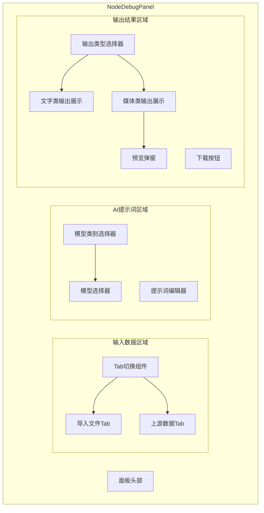

# Design Document: Node Debug Enhancement

## Overview

本设计文档描述节点调试面板（NodeDebugPanel）的增强功能实现方案。主要包括三个核心模块的改进：

1. **输入数据模块增强**：增加Tab切换，支持文件导入和上游数据两种输入方式
2. **AI提示词模块增强**：增加模型类别选择，根据类别动态加载对应模型列表
3. **输出结果模块增强**：支持多种输出格式，非文字类输出支持弹窗预览和下载

## Architecture



## Components and Interfaces

### 1. 输入数据Tab组件

```typescript
// 输入Tab类型
type InputTabType = 'file-import' | 'upstream-data'

// 支持的文件类型
const SUPPORTED_FILE_TYPES = {
  document: ['.doc', '.docx', '.pdf', '.xls', '.xlsx', '.ppt', '.pptx', '.csv', '.html', '.json'],
  image: ['.jpg', '.jpeg', '.png', '.gif', '.webp'],
  audio: ['.mp3', '.wav', '.m4a'],
  video: ['.mp4', '.webm', '.mov']
} as const

// 文件导入状态
interface ImportedFile {
  id: string
  name: string
  size: number
  type: string
  file: File
  previewUrl?: string
}

// InputTabsProps
interface InputTabsProps {
  activeTab: InputTabType
  onTabChange: (tab: InputTabType) => void
  importedFiles: ImportedFile[]
  onFilesChange: (files: ImportedFile[]) => void
  predecessorNodes: WorkflowNode[]
  mockInputs: Record<string, Record<string, any>>
  onMockInputChange: (nodeName: string, field: string, value: string) => void
}
```

### 2. 模型类别选择组件

```typescript
import { ModelModality } from '@/lib/ai/types'

// 模型类别显示名称映射
const MODALITY_LABELS: Record<ModelModality, string> = {
  'text': '文本类',
  'code': '代码类',
  'image-gen': '图片生成',
  'video-gen': '视频生成',
  'audio-transcription': '音频转录',
  'audio-tts': '文字转语音',
  'embedding': '向量嵌入',
  'ocr': '图文识别'
}

// ModalitySelectorProps
interface ModalitySelectorProps {
  selectedModality: ModelModality
  onModalityChange: (modality: ModelModality) => void
  availableModalities?: ModelModality[]
}

// ModelSelectorProps
interface ModelSelectorProps {
  modality: ModelModality
  selectedModel: string
  onModelChange: (model: string) => void
  providers: AIProviderConfig[]
  loading?: boolean
}
```

### 3. 输出结果组件

```typescript
// 输出类型
type OutputType = 
  | 'text'      // 纯文本
  | 'json'      // JSON
  | 'html'      // HTML
  | 'csv'       // CSV
  | 'word'      // Word文档
  | 'pdf'       // PDF文档
  | 'excel'     // Excel表格
  | 'ppt'       // PPT演示
  | 'image'     // 图片
  | 'audio'     // 音频
  | 'video'     // 视频

// 输出类型显示名称
const OUTPUT_TYPE_LABELS: Record<OutputType, string> = {
  'text': '纯文本',
  'json': 'JSON',
  'html': 'HTML',
  'csv': 'CSV',
  'word': 'Word',
  'pdf': 'PDF',
  'excel': 'Excel',
  'ppt': 'PPT',
  'image': '图片',
  'audio': '音频',
  'video': '视频'
}

// 输出结果数据
interface OutputResult {
  type: OutputType
  content: string | Blob | ArrayBuffer
  mimeType: string
  fileName?: string
  metadata?: {
    width?: number
    height?: number
    duration?: number
    size?: number
  }
}

// OutputSectionProps
interface OutputSectionProps {
  result: DebugResult | null
  outputType: OutputType
  onOutputTypeChange: (type: OutputType) => void
  nodeName: string
}

// PreviewModalProps
interface PreviewModalProps {
  isOpen: boolean
  onClose: () => void
  outputType: OutputType
  content: string | Blob
  fileName: string
  onDownload: () => void
}
```

## Data Models

### 扩展的调试结果类型

```typescript
interface EnhancedDebugResult extends DebugResult {
  // 原有字段
  status: 'success' | 'error' | 'skipped'
  output: Record<string, unknown>
  error?: string
  duration: number
  tokenUsage?: {
    promptTokens: number
    completionTokens: number
    totalTokens: number
  }
  logs?: string[]
  
  // 新增字段
  outputType?: OutputType
  outputContent?: {
    raw: string | Blob | ArrayBuffer
    mimeType: string
    fileName?: string
  }
}
```

### 节点配置扩展

```typescript
interface EnhancedProcessConfig {
  // 原有字段
  systemPrompt?: string
  userPrompt?: string
  model?: string
  aiConfigId?: string
  knowledgeBaseId?: string
  ragConfig?: RAGConfig
  knowledgeItems?: KnowledgeItem[]
  
  // 新增字段
  modality?: ModelModality        // 模型类别
  expectedOutputType?: OutputType // 期望输出类型
  importedFiles?: ImportedFile[]  // 导入的文件
}
```

## Correctness Properties

*A property is a characteristic or behavior that should hold true across all valid executions of a system-essentially, a formal statement about what the system should do. Properties serve as the bridge between human-readable specifications and machine-verifiable correctness guarantees.*

### Property 1: 文件类型验证

*For any* 文件扩展名，文件类型验证函数应正确判断该扩展名是否在支持的文件类型列表中，且判断结果与预期一致。

**Validates: Requirements 2.2, 2.4**

### Property 2: 模型类别切换一致性

*For any* 模型类别切换操作，切换后显示的模型列表应仅包含该类别下的模型，且自动选择的默认模型应属于该类别的默认模型配置。

**Validates: Requirements 3.4, 3.5**

### Property 3: 输出类型推断

*For any* 调试输出结果，根据输出内容的MIME类型或数据结构，推断出的输出类型应与实际内容类型匹配。

**Validates: Requirements 4.3**

### Property 4: CSV数据表格转换

*For any* 有效的CSV字符串，解析后生成的表格数据应保持行列结构完整，且重新序列化后应与原始数据等价。

**Validates: Requirements 5.3**

### Property 5: 下载文件名生成

*For any* 节点名称和时间戳组合，生成的下载文件名应包含节点名称、时间戳，且符合文件命名规范（无非法字符）。

**Validates: Requirements 7.3**

## Error Handling

### 文件上传错误

| 错误场景 | 处理方式 |
|---------|---------|
| 文件类型不支持 | 显示错误提示，拒绝上传 |
| 文件大小超限 | 显示错误提示，建议压缩或分割 |
| 上传网络失败 | 显示重试按钮，支持断点续传 |
| 文件解析失败 | 显示错误详情，建议检查文件格式 |

### 模型调用错误

| 错误场景 | 处理方式 |
|---------|---------|
| 模型不可用 | 提示切换其他模型 |
| API配额不足 | 显示配额信息，建议联系管理员 |
| 输入格式不匹配 | 提示检查输入数据格式 |

### 输出处理错误

| 错误场景 | 处理方式 |
|---------|---------|
| 输出解析失败 | 回退到纯文本显示 |
| 预览加载失败 | 显示错误占位图，提供下载选项 |
| 下载失败 | 显示重试按钮 |

## Testing Strategy

### 单元测试

使用 Vitest 进行单元测试：

1. **文件类型验证函数测试**
   - 测试所有支持的文件扩展名
   - 测试不支持的文件扩展名
   - 测试边界情况（空字符串、大小写）

2. **模型类别过滤函数测试**
   - 测试每个类别返回正确的模型列表
   - 测试默认模型选择逻辑

3. **输出类型推断函数测试**
   - 测试各种MIME类型的推断
   - 测试JSON结构检测

4. **CSV解析函数测试**
   - 测试标准CSV解析
   - 测试带引号的字段
   - 测试特殊字符处理

5. **文件名生成函数测试**
   - 测试正常节点名称
   - 测试包含特殊字符的节点名称
   - 测试时间戳格式

### 属性测试

使用 fast-check 进行属性测试，每个属性测试运行至少100次迭代：

1. **Property 1**: 文件类型验证属性测试
2. **Property 2**: 模型类别切换一致性属性测试
3. **Property 3**: 输出类型推断属性测试
4. **Property 4**: CSV数据表格转换属性测试
5. **Property 5**: 下载文件名生成属性测试

### 组件测试

使用 React Testing Library 进行组件测试：

1. **InputTabs组件测试**
   - Tab切换功能
   - 文件上传交互
   - 拖拽上传功能

2. **ModalitySelector组件测试**
   - 类别选择交互
   - 模型列表更新

3. **OutputSection组件测试**
   - 输出类型切换
   - 预览弹窗交互
   - 下载功能
