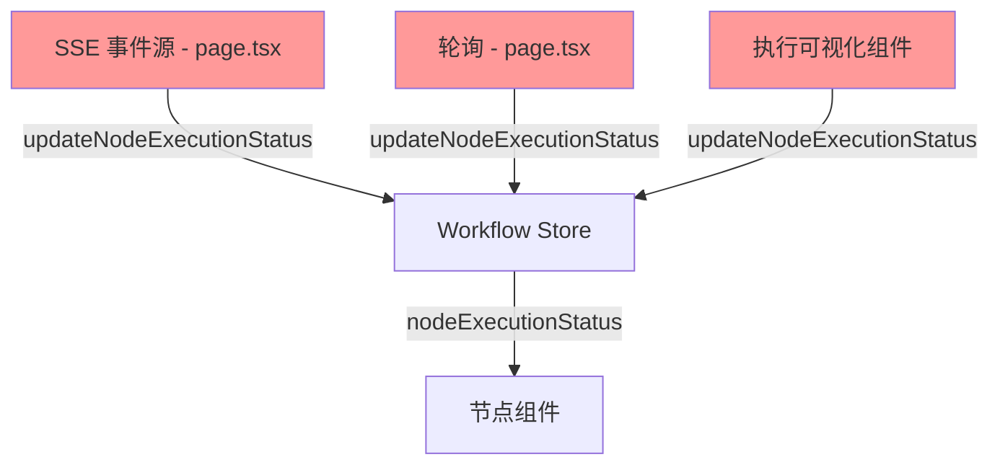
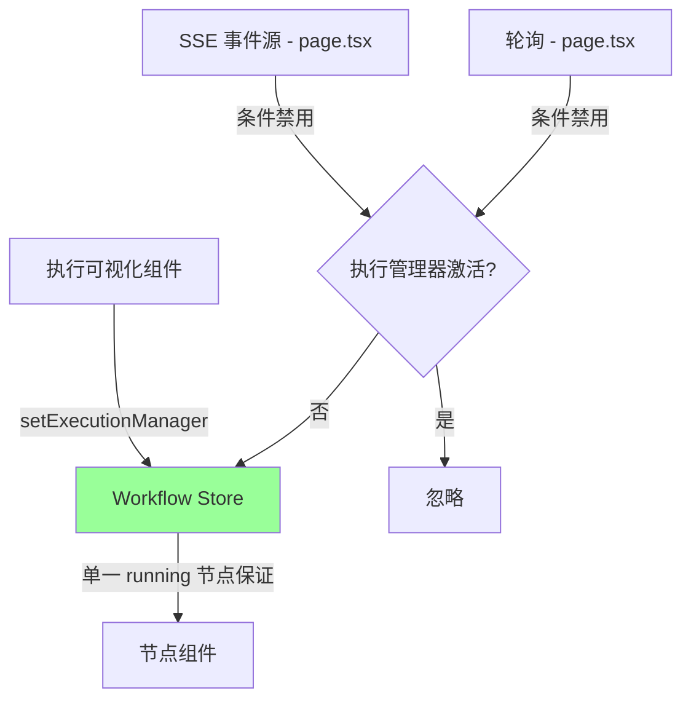
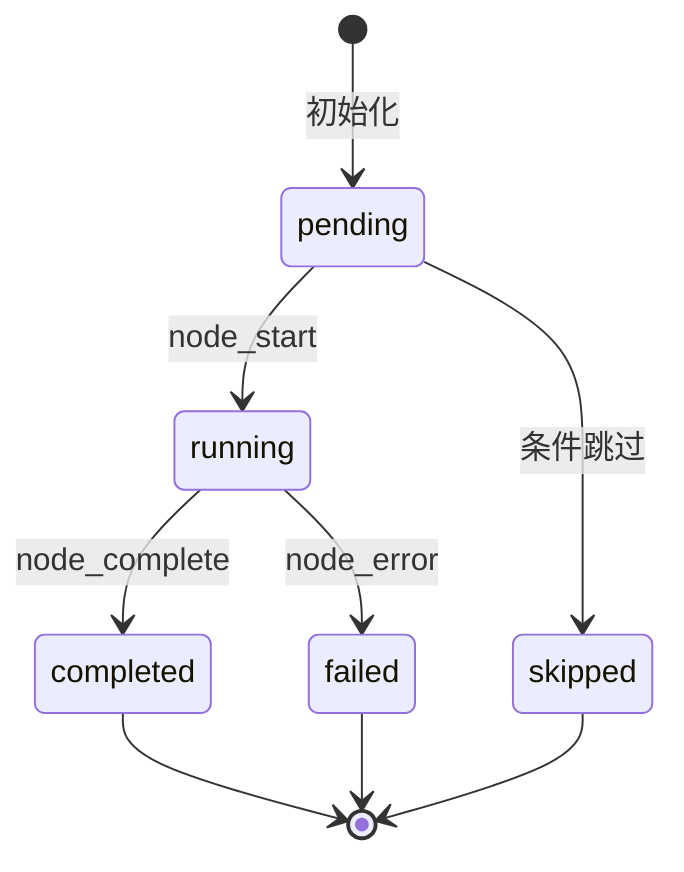

# Design Document: Node Highlight Sync

## Overview

本设计文档描述如何修复工作流执行时节点高亮显示与实际执行节点不同步的问题。核心解决方案是在 Workflow Store 中实现单一 running 节点的不变量，并通过事件源优先级管理避免竞态条件。

## Architecture

### 当前问题



问题：三个事件源同时更新状态，导致竞态条件。

### 解决方案架构



## Components and Interfaces

### 1. Workflow Store 扩展

```typescript
interface WorkflowStore {
  // 现有状态
  nodeExecutionStatus: Record<string, NodeExecutionStatus>;
  
  // 新增状态
  executionManagerActive: boolean;  // 是否有组件正在管理执行状态
  currentRunningNodeId: string | null;  // 当前正在执行的节点 ID
  statusUpdateTimestamps: Record<string, number>;  // 状态更新时间戳
  
  // 新增方法
  setExecutionManagerActive: (active: boolean) => void;
  updateNodeExecutionStatusSafe: (
    nodeId: string, 
    status: NodeExecutionStatus,
    timestamp?: number
  ) => void;
  clearRunningNodes: () => void;
  finalizeExecution: (success: boolean) => void;
}
```

### 2. 状态更新逻辑

```typescript
// 安全的状态更新方法
updateNodeExecutionStatusSafe: (nodeId, status, timestamp = Date.now()) => {
  const state = get();
  const currentStatus = state.nodeExecutionStatus[nodeId];
  const lastTimestamp = state.statusUpdateTimestamps[nodeId] || 0;
  
  // 1. 相同状态去重
  if (currentStatus === status) return;
  
  // 2. 时间戳验证（忽略过时更新）
  if (timestamp < lastTimestamp) return;
  
  // 3. 状态机验证（已完成/失败的节点不能变回 running）
  if ((currentStatus === 'completed' || currentStatus === 'failed') && status === 'running') {
    return;
  }
  
  // 4. 单一 running 节点保证
  if (status === 'running' && state.currentRunningNodeId && state.currentRunningNodeId !== nodeId) {
    // 将之前的 running 节点标记为 completed（假设正常完成）
    set({
      nodeExecutionStatus: {
        ...state.nodeExecutionStatus,
        [state.currentRunningNodeId]: 'completed',
        [nodeId]: status,
      },
      currentRunningNodeId: nodeId,
      statusUpdateTimestamps: {
        ...state.statusUpdateTimestamps,
        [state.currentRunningNodeId]: timestamp,
        [nodeId]: timestamp,
      },
    });
    return;
  }
  
  // 5. 正常更新
  set({
    nodeExecutionStatus: {
      ...state.nodeExecutionStatus,
      [nodeId]: status,
    },
    currentRunningNodeId: status === 'running' ? nodeId : 
      (state.currentRunningNodeId === nodeId ? null : state.currentRunningNodeId),
    statusUpdateTimestamps: {
      ...state.statusUpdateTimestamps,
      [nodeId]: timestamp,
    },
  });
}
```

### 3. 事件源协调

```typescript
// page.tsx 中的 SSE 订阅
const { connect: connectExecution } = useExecutionStream({
  onEvent: (event) => {
    // 检查是否有组件正在管理执行状态
    if (executionManagerActive) return;
    
    if (event.nodeId) {
      updateNodeExecutionStatusSafe(event.nodeId, mapEventToStatus(event.type));
    }
  },
  enabled: !executionManagerActive,  // 当执行管理器激活时禁用
});

// 轮询逻辑
useEffect(() => {
  if (!activeTaskId || showExecutionPanel || executionManagerActive) return;
  // ... 轮询逻辑
}, [activeTaskId, showExecutionPanel, executionManagerActive]);
```

## Data Models

### 状态更新时间戳

```typescript
interface StatusUpdateTimestamp {
  nodeId: string;
  timestamp: number;  // Unix 时间戳（毫秒）
}
```

### 执行状态机



## Correctness Properties

*A property is a characteristic or behavior that should hold true across all valid executions of a system—essentially, a formal statement about what the system should do. Properties serve as the bridge between human-readable specifications and machine-verifiable correctness guarantees.*

### Property 1: Single Running Node Invariant

*For any* workflow execution state, at most one node SHALL have status 'running' at any given time.

**Validates: Requirements 1.1, 1.2, 1.3**

### Property 2: Status Update Idempotence and Validity

*For any* sequence of status updates, applying the same update twice SHALL result in the same state as applying it once, and updates to terminal states (completed, failed) SHALL not regress to running.

**Validates: Requirements 3.1, 3.2**

### Property 3: Execution Finalization Consistency

*For any* workflow execution that completes (success or failure), no node SHALL remain in 'running' status after finalization.

**Validates: Requirements 4.1, 4.2, 4.3**

## Error Handling

1. **过时事件处理**: 通过时间戳验证忽略过时的状态更新
2. **竞态条件处理**: 通过 `executionManagerActive` 标志位协调多个事件源
3. **异常状态恢复**: 提供 `clearRunningNodes()` 方法用于清理异常状态

## Testing Strategy

### Unit Tests

- 测试 `updateNodeExecutionStatusSafe` 的去重逻辑
- 测试状态机转换的有效性验证
- 测试 `executionManagerActive` 标志位的正确设置

### Property-Based Tests

使用 fast-check 进行属性测试：

1. **Property 1**: 生成随机的状态更新序列，验证任意时刻最多只有一个 running 节点
2. **Property 2**: 生成随机的重复更新，验证幂等性；生成从终态到 running 的更新，验证被拒绝
3. **Property 3**: 模拟执行完成/失败，验证没有节点仍处于 running 状态

### Integration Tests

- 测试执行可视化组件打开/关闭时的事件源切换
- 测试 SSE 和轮询的协调工作
