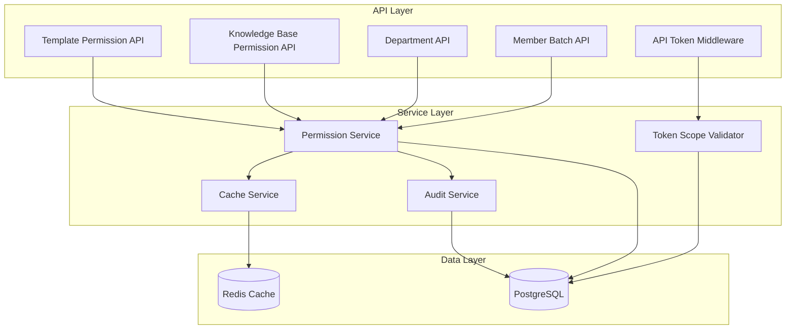
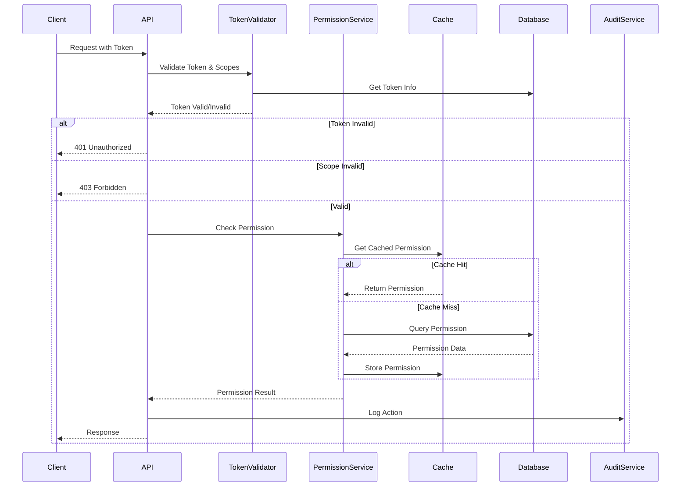

# Design Document: Permission System Enhancement

## Overview

本设计文档描述了AI Workflow平台权限管理系统的完善方案。基于现有权限系统问题分析，本设计涵盖模板权限API、知识库权限缓存、API Token作用域验证、部门权限检查、审计日志完善等核心功能的实现方案。

## Architecture

### 系统架构图



### 权限检查流程



## Components and Interfaces

### 1. Template Permission API

```typescript
// src/app/api/templates/[id]/permissions/route.ts

interface TemplatePermissionRequest {
  targetType: 'USER' | 'DEPARTMENT' | 'ALL'
  targetId: string | null
  permission: 'VIEWER' | 'EDITOR' | 'MANAGER'
}

interface TemplatePermissionResponse {
  data: PermissionListItem[]
  currentUserPermission: ResourcePermission | null
  canManage: boolean
}

// GET - 获取模板权限列表
// POST - 添加/更新模板权限
// DELETE - 删除模板权限
```

### 2. Knowledge Base Permission Cache

```typescript
// src/lib/permissions/knowledge-base.ts

interface KBPermissionCacheService {
  // 获取知识库权限（带缓存）
  getKnowledgeBasePermissionLevel(
    userId: string,
    knowledgeBaseId: string
  ): Promise<ResourcePermission | null>
  
  // 检查知识库权限（带缓存）
  checkKnowledgeBasePermission(
    userId: string,
    knowledgeBaseId: string,
    requiredPermission: ResourcePermission
  ): Promise<boolean>
  
  // 清除知识库权限缓存
  invalidateKnowledgeBasePermissionCache(
    knowledgeBaseId: string
  ): Promise<void>
}
```

### 3. API Token Scope Validator

```typescript
// src/lib/auth/token-scope-validator.ts

type TokenScope = 'workflows' | 'knowledge-bases' | 'templates' | 'executions' | 'tools' | '*'

interface TokenScopeValidator {
  // 验证Token作用域
  validateScope(
    token: ApiToken,
    requiredScope: TokenScope
  ): boolean
  
  // 从请求路径推断所需作用域
  inferScopeFromPath(path: string): TokenScope | null
}
```

### 4. Department Visibility Service

```typescript
// src/lib/permissions/department-visibility.ts

interface DepartmentVisibilityService {
  // 获取用户可见的部门ID列表
  getVisibleDepartmentIds(
    userId: string,
    organizationId: string
  ): Promise<string[]>
  
  // 检查用户是否可以查看指定部门
  canViewDepartment(
    userId: string,
    departmentId: string
  ): Promise<boolean>
}
```

### 5. Audit Log Service

```typescript
// src/lib/audit/audit-service.ts

type AuditEventType = 
  | 'permission.added'
  | 'permission.updated'
  | 'permission.removed'
  | 'department.created'
  | 'department.updated'
  | 'department.deleted'
  | 'api_token.created'
  | 'api_token.revoked'
  | 'organization.status_changed'

interface AuditLogEntry {
  eventType: AuditEventType
  operatorId: string
  targetResource: string
  targetResourceId: string
  changes: Record<string, { old: unknown; new: unknown }>
  metadata?: Record<string, unknown>
}

interface AuditService {
  log(entry: AuditLogEntry): Promise<void>
  logBatch(entries: AuditLogEntry[]): Promise<void>
}
```

### 6. Member Batch Operations API

```typescript
// src/app/api/settings/members/batch/route.ts

interface BatchOperationRequest {
  memberIds: string[]
  operation: 'delete' | 'updateRole' | 'updateDepartment'
  data?: {
    role?: Role
    departmentId?: string
  }
}

interface BatchOperationResponse {
  success: string[]  // 成功的成员ID列表
  failed: Array<{
    memberId: string
    reason: string
  }>
}
```

### 7. Organization Security Settings Type

```typescript
// src/types/organization.ts

interface PasswordPolicy {
  minLength: number
  requireUppercase: boolean
  requireLowercase: boolean
  requireNumbers: boolean
  requireSpecialChars: boolean
  maxAge: number  // 密码最大有效期（天）
}

interface OrganizationSecuritySettings {
  passwordPolicy: PasswordPolicy
  sessionTimeout: number  // 会话超时时间（分钟）
  ipWhitelist: string[]  // IP白名单
  mfaRequired: boolean  // 是否强制MFA
  loginAttemptLimit: number  // 登录尝试次数限制
  lockoutDuration: number  // 锁定时长（分钟）
}

const DEFAULT_SECURITY_SETTINGS: OrganizationSecuritySettings = {
  passwordPolicy: {
    minLength: 8,
    requireUppercase: true,
    requireLowercase: true,
    requireNumbers: true,
    requireSpecialChars: false,
    maxAge: 90
  },
  sessionTimeout: 480,
  ipWhitelist: [],
  mfaRequired: false,
  loginAttemptLimit: 5,
  lockoutDuration: 30
}
```

## Data Models

### 缓存键设计

```typescript
// 知识库权限缓存键
const kbPermissionCacheKey = (userId: string, kbId: string) => 
  `kb:permission:${kbId}:${userId}`

// 知识库权限缓存模式（用于批量删除）
const kbPermissionPatternByKB = (kbId: string) => 
  `kb:permission:${kbId}:*`

// 缓存TTL
const KB_PERMISSION_CACHE_TTL = 300  // 5分钟
```

### 审计日志数据模型

```typescript
// 扩展现有AuditLog模型
model AuditLog {
  id            String   @id @default(cuid())
  eventType     String   // 事件类型
  operatorId    String   // 操作者ID
  operatorName  String?  // 操作者名称（冗余存储）
  targetResource String  // 目标资源类型
  targetResourceId String // 目标资源ID
  changes       Json     // 变更详情
  metadata      Json?    // 额外元数据
  ipAddress     String?  // 操作者IP
  userAgent     String?  // 用户代理
  createdAt     DateTime @default(now())
  
  organizationId String
  organization   Organization @relation(...)
  
  @@index([organizationId, eventType])
  @@index([operatorId])
  @@index([targetResource, targetResourceId])
  @@index([createdAt])
}
```

## Correctness Properties

*A property is a characteristic or behavior that should hold true across all valid executions of a system-essentially, a formal statement about what the system should do. Properties serve as the bridge between human-readable specifications and machine-verifiable correctness guarantees.*

### Property 1: Template Permission CRUD Consistency

*For any* template and any valid permission configuration, adding a permission then querying the permission list should include the added permission with correct target type, target ID, and permission level.

**Validates: Requirements 1.1, 1.2, 1.3, 1.4**

### Property 2: Permission Management Authorization

*For any* user without MANAGER permission on a template, attempting to add, update, or delete permissions on that template should result in a 403 Forbidden response.

**Validates: Requirements 1.5**

### Property 3: Knowledge Base Permission Cache Behavior

*For any* knowledge base permission query, if the cache contains the permission data, the result should match the cached value without database query; if the cache is empty, the result should be stored in cache after database query.

**Validates: Requirements 2.1, 2.2, 2.3**

### Property 4: Cache Invalidation on Permission Change

*For any* knowledge base permission modification (add, update, delete), all related permission cache entries for that knowledge base should be invalidated.

**Validates: Requirements 2.4**

### Property 5: API Token Scope Enforcement

*For any* API request with a token, if the token's scopes do not include the required scope for the requested resource, the request should be rejected with 403 Forbidden; if scopes is empty or contains '*', all resources should be accessible.

**Validates: Requirements 3.1, 3.2, 3.3**

### Property 6: Department Visibility by Role

*For any* department list request, OWNER/ADMIN users should see all departments, department managers should see their managed departments and descendants, and regular members should only see their own department and its descendants.

**Validates: Requirements 4.1, 4.2, 4.3, 4.4**

### Property 7: Department Level Calculation

*For any* newly created department, the level field should equal the parent department's level plus one, and should not exceed 10.

**Validates: Requirements 5.1, 5.3**

### Property 8: Cross-Organization Access Prevention

*For any* API token accessing a resource, if the resource belongs to a different organization than the token, the response should be 404 Not Found (not 403 Forbidden).

**Validates: Requirements 6.1, 6.2, 6.3**

### Property 9: Audit Log Completeness

*For any* permission, department, API token, or organization status change operation, an audit log entry should be created containing operator ID, timestamp, event type, target resource, and change details.

**Validates: Requirements 7.1, 7.2, 7.3, 7.4, 7.5**

### Property 10: Permission API Response Format Consistency

*For any* permission API response (workflow, knowledge base, or template), the response should contain data array, currentUserPermission string, and canManage boolean fields.

**Validates: Requirements 8.1, 8.2, 8.3**

### Property 11: Batch Operation Result Completeness

*For any* batch member operation, the response should contain both success and failed arrays, and the union of these arrays should equal the input member IDs.

**Validates: Requirements 10.1, 10.2, 10.3, 10.4, 10.5**

## Error Handling

### 错误码定义

| 错误码 | HTTP状态 | 描述 |
|--------|----------|------|
| PERMISSION_DENIED | 403 | 用户没有执行该操作的权限 |
| RESOURCE_NOT_FOUND | 404 | 资源不存在或不可访问 |
| INVALID_SCOPE | 403 | Token作用域不包含所需资源 |
| DEPARTMENT_DEPTH_EXCEEDED | 400 | 部门层级超过最大深度限制 |
| BATCH_OPERATION_PARTIAL_FAILURE | 207 | 批量操作部分失败 |
| CACHE_ERROR | 500 | 缓存操作失败（降级到数据库查询） |

### 错误处理策略

1. **缓存失败降级**: 当Redis不可用时，直接查询数据库，不影响业务
2. **批量操作事务**: 批量操作使用事务，单个失败不影响其他操作
3. **跨组织访问**: 返回404而非403，避免信息泄露

## Testing Strategy

### 单元测试

- 权限检查函数的边界条件测试
- 缓存键生成和TTL设置测试
- 部门层级计算测试
- Token作用域解析测试

### 属性测试

使用fast-check进行属性测试，每个属性测试运行至少100次迭代。

测试框架配置：
- 测试框架: Vitest
- 属性测试库: fast-check
- 最小迭代次数: 100

### 集成测试

- API端点的完整请求-响应测试
- 缓存命中/未命中场景测试
- 审计日志记录验证测试
- 批量操作的事务一致性测试

