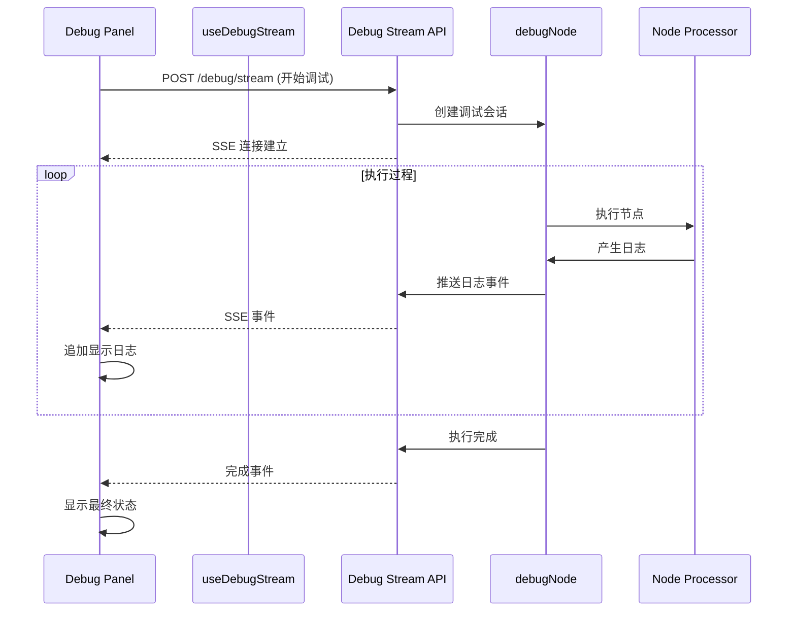

# Design Document: 实时调试日志

## Overview

本设计实现节点调试面板的实时日志流功能。当前系统在节点执行时，"调试过程"区域显示"等待执行..."，直到执行完成后才一次性显示所有日志。本功能将改进为在执行过程中实时流式显示日志，让用户能够即时了解执行进度。

### 设计目标

1. 实现调试日志的实时流式传输
2. 提供清晰的执行状态指示
3. 支持日志格式化显示（时间戳、级别颜色、JSON 格式化）
4. 保持与现有架构的兼容性

## Architecture

### 整体架构



### 技术方案

采用 Server-Sent Events (SSE) 实现实时日志流，复用项目中已有的 SSE 基础设施（`useExecutionStream` hook 和执行流 API）。

## Components and Interfaces

### 1. 调试日志事件类型

```typescript
// src/lib/workflow/debug-events.ts

export interface DebugLogEvent {
  type: 'log' | 'status' | 'complete' | 'error';
  timestamp: string;
  data: DebugLogData | DebugStatusData | DebugCompleteData | DebugErrorData;
}

export interface DebugLogData {
  level: 'info' | 'step' | 'success' | 'warning' | 'error';
  message: string;
  step?: string;
  data?: unknown;
}

export interface DebugStatusData {
  status: 'running' | 'completed' | 'failed';
  progress?: number;
}

export interface DebugCompleteData {
  status: 'success' | 'error' | 'skipped' | 'paused';
  output: Record<string, unknown>;
  error?: string;
  duration: number;
  tokenUsage?: {
    promptTokens: number;
    completionTokens: number;
    totalTokens: number;
  };
}

export interface DebugErrorData {
  message: string;
  stack?: string;
}
```

### 2. 调试流 API

```typescript
// src/app/api/workflows/[id]/nodes/[nodeId]/debug/stream/route.ts

export async function POST(request: NextRequest, { params }) {
  // 1. 验证请求
  // 2. 创建 SSE 响应流
  // 3. 执行调试，实时推送日志
  // 4. 完成后关闭流
}
```

### 3. 前端 Hook

```typescript
// src/hooks/use-debug-stream.ts

export interface UseDebugStreamOptions {
  onLog?: (log: DebugLogData) => void;
  onStatus?: (status: DebugStatusData) => void;
  onComplete?: (result: DebugCompleteData) => void;
  onError?: (error: string) => void;
}

export interface UseDebugStreamReturn {
  isConnected: boolean;
  isRunning: boolean;
  logs: DebugLogData[];
  status: 'idle' | 'running' | 'completed' | 'failed';
  result: DebugCompleteData | null;
  error: string | null;
  startDebug: (params: DebugParams) => void;
  stopDebug: () => void;
  clearLogs: () => void;
}

export function useDebugStream(options?: UseDebugStreamOptions): UseDebugStreamReturn;
```

### 4. 日志显示组件

```typescript
// src/components/workflow/debug-panel/debug-log-viewer.tsx

export interface DebugLogViewerProps {
  logs: DebugLogData[];
  isRunning: boolean;
  status: 'idle' | 'running' | 'completed' | 'failed';
  autoScroll?: boolean;
  onCopy?: () => void;
}

export function DebugLogViewer(props: DebugLogViewerProps): JSX.Element;
```

## Data Models

### 日志级别样式映射

```typescript
const LOG_LEVEL_STYLES = {
  info: {
    icon: '🔹',
    color: 'text-blue-400',
    bgColor: 'bg-blue-950/30',
  },
  step: {
    icon: '⚡',
    color: 'text-yellow-400',
    bgColor: 'bg-yellow-950/30',
  },
  success: {
    icon: '✅',
    color: 'text-green-400',
    bgColor: 'bg-green-950/30',
  },
  warning: {
    icon: '⚠️',
    color: 'text-orange-400',
    bgColor: 'bg-orange-950/30',
  },
  error: {
    icon: '❌',
    color: 'text-red-400',
    bgColor: 'bg-red-950/30',
  },
};
```

### 执行状态

```typescript
type DebugStatus = 'idle' | 'running' | 'completed' | 'failed';

interface DebugState {
  status: DebugStatus;
  logs: DebugLogData[];
  result: DebugCompleteData | null;
  error: string | null;
  startTime: number | null;
}
```

## Correctness Properties

*A property is a characteristic or behavior that should hold true across all valid executions of a system-essentially, a formal statement about what the system should do. Properties serve as the bridge between human-readable specifications and machine-verifiable correctness guarantees.*

### Property 1: 实时日志传输

*For any* 调试执行过程中产生的日志事件，该日志 SHALL 在 500ms 内被追加到前端显示区域。

**Validates: Requirements 1.2, 2.2**

### Property 2: 执行状态一致性

*For any* 调试执行，当执行开始时 UI 状态 SHALL 从 'idle' 变为 'running'，当执行完成时 SHALL 变为 'completed' 或 'failed'，且最终状态与后端返回的状态一致。

**Validates: Requirements 1.1, 1.4, 3.1, 3.3, 3.4**

### Property 3: 日志格式完整性

*For any* 显示的日志条目，SHALL 包含时间戳、级别图标、消息内容，且不同级别的日志 SHALL 使用对应的颜色样式。

**Validates: Requirements 4.1, 4.2**

### Property 4: JSON 数据格式化

*For any* 包含 JSON 数据的日志条目，JSON 内容 SHALL 以缩进格式化的方式显示，而非单行字符串。

**Validates: Requirements 4.3**

### Property 5: 流生命周期管理

*For any* 调试流连接，当执行完成或发生错误时，流 SHALL 正确关闭，不产生资源泄漏。

**Validates: Requirements 2.4**

### Property 6: 自动滚动行为

*For any* 新追加的日志，当日志区域已滚动到底部时，SHALL 自动滚动以显示最新日志；当用户手动向上滚动时，SHALL 暂停自动滚动。

**Validates: Requirements 1.3**

## Error Handling

### 连接错误处理

1. **SSE 连接失败**: 显示错误提示，提供重试按钮
2. **连接中断**: 自动尝试重连（最多 3 次），失败后显示错误
3. **超时**: 显示超时提示，允许用户取消或继续等待

### 执行错误处理

1. **节点执行错误**: 在日志中显示错误信息，标记为 error 级别
2. **处理器未找到**: 显示明确的错误提示
3. **配置错误**: 在日志中显示配置问题详情

### 错误恢复策略

```typescript
const RECONNECT_CONFIG = {
  maxRetries: 3,
  retryDelay: 1000, // ms
  backoffMultiplier: 2,
};
```

## Testing Strategy

### 单元测试

1. **日志格式化函数测试**: 验证不同类型日志的格式化输出
2. **状态转换测试**: 验证状态机的正确转换
3. **JSON 格式化测试**: 验证 JSON 数据的格式化显示

### 属性测试

使用 fast-check 进行属性测试：

1. **Property 1 测试**: 生成随机日志事件序列，验证传输延迟
2. **Property 2 测试**: 生成随机执行结果，验证状态一致性
3. **Property 3 测试**: 生成随机日志数据，验证格式完整性
4. **Property 4 测试**: 生成随机 JSON 对象，验证格式化输出

### 集成测试

1. **端到端流测试**: 验证从 API 到 UI 的完整流程
2. **错误恢复测试**: 模拟连接断开，验证重连机制

### 测试框架

- 单元测试: Vitest
- 属性测试: fast-check
- 组件测试: React Testing Library

