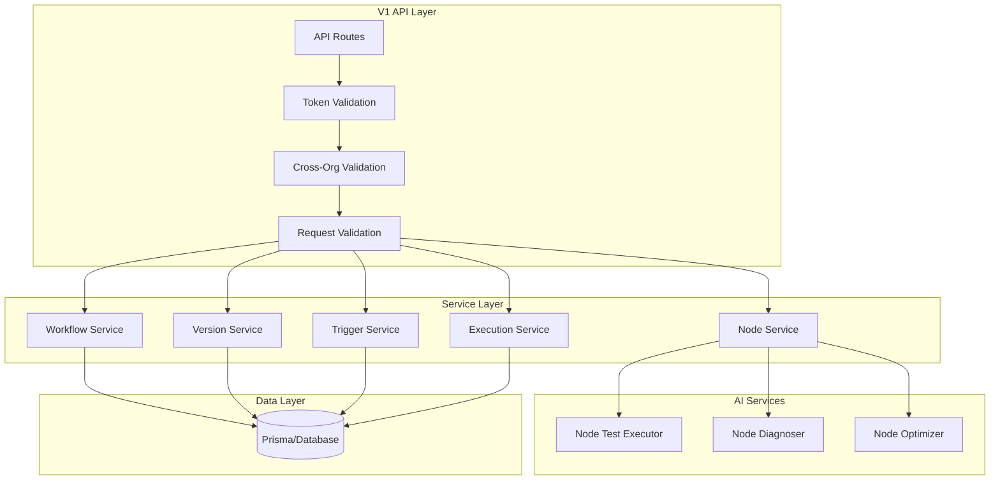

# Design Document: V1 Workflow API Enhancement

## Overview

本设计文档描述了 V1 公开 API 的工作流管理能力扩展，包括节点级别操作（更新、删除、测试、诊断、优化）、工作流复制、版本管理、触发器管理和执行历史查询等功能。所有 API 使用 API Token 认证，遵循现有的 V1 API 设计模式。

## Architecture



## Components and Interfaces

### 1. Node Operations API

#### PUT /api/v1/workflows/[id]/nodes/[nodeId]
更新指定节点的配置。

```typescript
// Request
interface UpdateNodeRequest {
  name?: string;
  type?: NodeType;
  position?: { x: number; y: number };
  config?: NodeConfigData;
}

// Response
interface UpdateNodeResponse {
  node: NodeConfig;
  workflowVersion: number;
}
```

#### DELETE /api/v1/workflows/[id]/nodes/[nodeId]
删除指定节点及其关联的边。

```typescript
// Response
interface DeleteNodeResponse {
  deleted: {
    node: NodeConfig;
    edges: EdgeConfig[];
  };
  workflowVersion: number;
}
```


#### POST /api/v1/workflows/[id]/nodes/[nodeId]/test
测试单个节点的执行。

```typescript
// Request
interface TestNodeRequest {
  input: Record<string, unknown>;
  timeout?: number; // 默认 30000ms
}

// Response
interface TestNodeResponse {
  success: boolean;
  output?: unknown;
  error?: {
    message: string;
    stack?: string;
  };
  metrics: {
    duration: number;
    promptTokens?: number;
    completionTokens?: number;
    totalTokens?: number;
  };
}
```

#### GET /api/v1/workflows/[id]/nodes/[nodeId]/diagnose
诊断节点配置问题。

```typescript
// Response
interface DiagnoseNodeResponse {
  status: 'healthy' | 'warning' | 'error';
  issues: Array<{
    severity: 'error' | 'warning' | 'info';
    code: string;
    message: string;
    field?: string;
    suggestion?: string;
  }>;
}
```

#### POST /api/v1/workflows/[id]/nodes/[nodeId]/optimize
获取节点优化建议。

```typescript
// Request
interface OptimizeNodeRequest {
  apply?: boolean; // 是否自动应用第一个建议
}

// Response
interface OptimizeNodeResponse {
  suggestions: Array<{
    id: string;
    title: string;
    description: string;
    rationale: string;
    suggestedConfig: NodeConfigData;
    impact: 'high' | 'medium' | 'low';
  }>;
  appliedSuggestion?: string; // 如果 apply=true
  updatedNode?: NodeConfig;   // 如果 apply=true
  tokenUsage: {
    promptTokens: number;
    completionTokens: number;
    totalTokens: number;
  };
}
```

### 2. Workflow Duplicate API

#### POST /api/v1/workflows/[id]/duplicate

```typescript
// Request
interface DuplicateWorkflowRequest {
  name?: string; // 可选，默认追加 "(副本)"
}

// Response: 返回新创建的 Workflow 对象
```

### 3. Version Management API

#### GET /api/v1/workflows/[id]/versions

```typescript
// Query Parameters
interface VersionListParams {
  page?: number;
  pageSize?: number;
}

// Response
interface VersionListResponse {
  versions: Array<{
    id: string;
    versionNumber: number;
    versionTag?: string;
    commitMessage: string;
    isPublished: boolean;
    createdAt: string;
    createdBy: { id: string; name: string };
  }>;
  pagination: { page: number; pageSize: number; total: number };
}
```

#### POST /api/v1/workflows/[id]/versions

```typescript
// Request
interface CreateVersionRequest {
  commitMessage: string;
  versionTag?: string;
  publish?: boolean;
}
```

#### GET /api/v1/workflows/[id]/versions/[versionId]

返回特定版本的完整配置。

#### POST /api/v1/workflows/[id]/versions/[versionId]/restore

将工作流恢复到指定版本。

### 4. Trigger Management API

#### GET/POST /api/v1/workflows/[id]/triggers

```typescript
// Create Request
interface CreateTriggerRequest {
  name: string;
  type: 'WEBHOOK' | 'SCHEDULE';
  enabled?: boolean;
  cronExpression?: string; // SCHEDULE 类型必填
  timezone?: string;
  inputTemplate?: Record<string, unknown>;
  retryOnFail?: boolean;
  maxRetries?: number;
}

// Response (for WEBHOOK)
interface WebhookTriggerResponse {
  id: string;
  name: string;
  type: 'WEBHOOK';
  enabled: boolean;
  webhookUrl: string;
  webhookSecret: string; // 仅创建时返回
  // ...
}
```

#### PUT /api/v1/workflows/[id]/triggers/[triggerId]
#### DELETE /api/v1/workflows/[id]/triggers/[triggerId]

### 5. Execution History API

#### GET /api/v1/workflows/[id]/executions

```typescript
// Query Parameters
interface ExecutionListParams {
  page?: number;
  pageSize?: number;
  status?: 'PENDING' | 'RUNNING' | 'COMPLETED' | 'FAILED';
  startDate?: string; // ISO date
  endDate?: string;
}

// Response
interface ExecutionListResponse {
  executions: Array<{
    id: string;
    status: string;
    duration?: number;
    totalTokens?: number;
    createdAt: string;
  }>;
  pagination: { page: number; pageSize: number; total: number };
}
```

#### GET /api/v1/workflows/[id]/executions/[executionId]

返回完整执行详情，包括输入、输出和节点级结果。

### 6. Enhanced Workflow Creation

扩展现有 POST /api/v1/workflows：

```typescript
// Extended Request
interface CreateWorkflowRequest {
  name: string;
  description?: string;
  // 方式1: 完整配置
  config?: WorkflowConfig;
  // 方式2: 从模板创建
  templateId?: string;
  // 方式3: 从节点数组构建
  nodes?: NodeConfig[];
  autoConnect?: boolean; // 自动按顺序连接节点
  // 验证选项
  validateOnCreate?: boolean;
  // 初始触发器
  triggers?: CreateTriggerRequest[];
}
```


## Data Models

### Node Diagnosis Issue

```typescript
interface DiagnosisIssue {
  severity: 'error' | 'warning' | 'info';
  code: string;
  message: string;
  field?: string;
  suggestion?: string;
}

// Issue Codes
const DIAGNOSIS_CODES = {
  // Errors
  MISSING_REQUIRED_FIELD: 'missing_required_field',
  INVALID_VARIABLE_REF: 'invalid_variable_ref',
  CIRCULAR_DEPENDENCY: 'circular_dependency',
  
  // Warnings
  EMPTY_PROMPT: 'empty_prompt',
  LONG_PROMPT: 'long_prompt',
  COMPLEX_CODE: 'complex_code',
  UNUSED_INPUT: 'unused_input',
  
  // Info
  OPTIMIZATION_AVAILABLE: 'optimization_available',
};
```

### Optimization Suggestion

```typescript
interface OptimizationSuggestion {
  id: string;
  title: string;
  description: string;
  rationale: string;
  suggestedConfig: NodeConfigData;
  impact: 'high' | 'medium' | 'low';
  category: 'prompt' | 'performance' | 'error_handling' | 'clarity';
}
```

## Correctness Properties

*A property is a characteristic or behavior that should hold true across all valid executions of a system—essentially, a formal statement about what the system should do. Properties serve as the bridge between human-readable specifications and machine-verifiable correctness guarantees.*

### Property 1: Node Update Preserves Workflow Integrity

*For any* valid workflow and any valid node update request, updating a node SHALL result in:
- The node's configuration being updated to match the request
- The workflow version being incremented by 1
- The publishStatus changing to DRAFT_MODIFIED if it was PUBLISHED
- All other nodes remaining unchanged

**Validates: Requirements 1.1, 1.3, 1.4**

### Property 2: Node Deletion Removes Connected Edges

*For any* workflow with nodes and edges, deleting a node SHALL result in:
- The node being removed from the workflow
- All edges where the node is source or target being removed
- The workflow version being incremented
- The response containing the deleted node and all removed edges

**Validates: Requirements 2.1, 2.3, 2.4**

### Property 3: Node Test Returns Consistent Structure

*For any* testable node (PROCESS or CODE type) and any valid input, the test response SHALL contain:
- A success boolean indicating execution result
- Output data if successful, error details if failed
- Metrics including duration (and token usage for PROCESS nodes)

**Validates: Requirements 3.1, 3.3, 3.4, 3.5**

### Property 4: Node Diagnosis Detects Invalid References

*For any* node configuration containing variable references, the diagnosis SHALL:
- Identify all references to non-existent nodes
- Identify all references to non-existent fields
- Return each as an issue with severity 'error' or 'warning'

**Validates: Requirements 4.2, 4.3, 4.5**

### Property 5: Optimization Response Structure

*For any* optimization request, the response SHALL contain:
- An array of suggestions (may be empty)
- Each suggestion with id, title, description, rationale, suggestedConfig, and impact
- Token usage information for the AI analysis

**Validates: Requirements 5.4, 5.6**

### Property 6: Workflow Duplicate Creates Independent Copy

*For any* workflow, duplicating it SHALL result in:
- A new workflow with a different ID
- The name being the original name + "(副本)" (unless custom name provided)
- The config (nodes, edges) being identical to the source
- publishStatus being DRAFT and version being 1
- Changes to the copy not affecting the original

**Validates: Requirements 6.1, 6.2, 6.3, 6.4, 6.5**

### Property 7: Version Creation and Retrieval Round-Trip

*For any* workflow, creating a version and then retrieving it SHALL return a configuration that is equivalent to the workflow's configuration at the time of version creation.

**Validates: Requirements 7.2, 7.3**

### Property 8: Version Restore Recovers Configuration

*For any* workflow with multiple versions, restoring to a previous version SHALL result in the workflow's current configuration matching that version's stored configuration.

**Validates: Requirements 7.4**

### Property 9: Trigger CRUD Operations

*For any* workflow, trigger operations SHALL satisfy:
- Created triggers appear in the list
- Updated triggers reflect the changes
- Deleted triggers no longer appear in the list
- WEBHOOK triggers have generated URL and secret
- SCHEDULE triggers have valid cron expressions

**Validates: Requirements 8.1, 8.2, 8.3, 8.4, 8.5, 8.6**

### Property 10: Execution History Filtering

*For any* workflow with executions, filtering by status SHALL return only executions matching that status, and filtering by date range SHALL return only executions within that range.

**Validates: Requirements 9.2, 9.3**

### Property 11: Template-Based Workflow Creation

*For any* valid template, creating a workflow with that templateId SHALL result in a workflow whose configuration matches the template's configuration.

**Validates: Requirements 10.1**

### Property 12: Auto-Connect Node Sequencing

*For any* array of nodes provided with autoConnect=true, the created workflow SHALL have edges connecting each node to the next in sequence (node[0] → node[1] → node[2] → ...).

**Validates: Requirements 10.3**


## Error Handling

### Standard Error Response

```typescript
interface ApiErrorResponse {
  success: false;
  error: {
    code: string;
    message: string;
    details?: Record<string, unknown>;
  };
}
```

### Error Codes

| Code | HTTP Status | Description |
|------|-------------|-------------|
| `unauthorized` | 401 | API Token 无效或缺少必要的 scope |
| `forbidden` | 403 | 无权访问该资源 |
| `not_found` | 404 | 工作流或节点不存在 |
| `validation_error` | 400 | 请求参数验证失败 |
| `conflict` | 409 | 版本冲突 |
| `node_not_testable` | 400 | INPUT/OUTPUT 节点不支持独立测试 |
| `invalid_cron` | 400 | Cron 表达式格式无效 |
| `cannot_delete_input` | 400 | 不能删除唯一的 INPUT 节点 |

### Cross-Organization Security

所有 API 都实现跨组织验证，当访问不属于 Token 所属组织的资源时，返回 404 而非 403，避免信息泄露。

## Testing Strategy

### Unit Tests

- 测试各 API 路由的请求验证逻辑
- 测试节点诊断的各种问题检测
- 测试 Cron 表达式验证
- 测试边界情况（空数组、无效 ID 等）

### Property-Based Tests

使用 `fast-check` 库进行属性测试，每个测试运行至少 100 次迭代。

测试标签格式: `Feature: v1-workflow-api-enhancement, Property {number}: {property_text}`

#### 测试覆盖

1. **节点更新属性测试**: 生成随机节点配置，验证更新后的一致性
2. **节点删除属性测试**: 生成随机工作流，验证删除后边的清理
3. **版本往返测试**: 创建版本后检索，验证配置一致性
4. **触发器 CRUD 测试**: 验证创建、更新、删除操作的正确性
5. **执行历史过滤测试**: 验证状态和日期过滤的正确性
6. **工作流复制测试**: 验证复制后的独立性和配置一致性
7. **自动连接测试**: 验证节点按顺序连接

### Integration Tests

- 完整的 API 调用流程测试
- Token 认证和权限验证测试
- 跨组织访问安全测试

## Implementation Notes

### 复用现有代码

1. **Token 验证**: 复用 `validateApiTokenWithScope` 和 `updateTokenUsage`
2. **跨组织验证**: 复用 `validateCrossOrganization` 和 `createCrossOrgNotFoundResponse`
3. **工作流服务**: 复用 `workflowService` 的 `copy`, `getById` 等方法
4. **版本服务**: 复用 `versionService` 的 `getVersions`, `createVersion` 等方法
5. **触发器逻辑**: 参考内部 API 的触发器实现

### 新增服务

1. **NodeTestService**: 执行单个节点的测试
2. **NodeDiagnosisService**: 分析节点配置问题
3. **NodeOptimizationService**: 调用 AI 生成优化建议

### 文件结构

```
src/app/api/v1/workflows/[id]/
├── nodes/
│   ├── route.ts                    # GET (list), POST (create) - 已存在
│   └── [nodeId]/
│       ├── route.ts                # PUT (update), DELETE (delete) - 新增
│       ├── test/
│       │   └── route.ts            # POST (test node) - 新增
│       ├── diagnose/
│       │   └── route.ts            # GET (diagnose) - 新增
│       └── optimize/
│           └── route.ts            # POST (optimize) - 新增
├── duplicate/
│   └── route.ts                    # POST (duplicate) - 新增
├── versions/
│   ├── route.ts                    # GET (list), POST (create) - 新增
│   └── [versionId]/
│       ├── route.ts                # GET (detail) - 新增
│       └── restore/
│           └── route.ts            # POST (restore) - 新增
├── triggers/
│   ├── route.ts                    # GET (list), POST (create) - 新增
│   └── [triggerId]/
│       └── route.ts                # PUT (update), DELETE (delete) - 新增
└── executions/
    ├── route.ts                    # GET (list) - 新增
    └── [executionId]/
        └── route.ts                # GET (detail) - 新增
```
