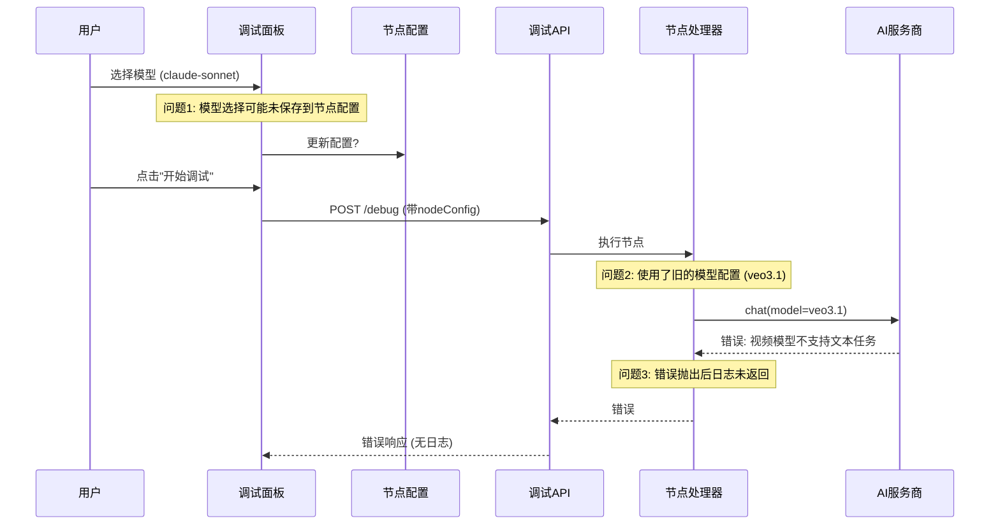

# Design Document: Workflow Model Config Fix

## Overview

本设计文档描述了修复工作流节点调试中模型配置不一致问题的技术方案。主要解决两个问题：
1. 用户在调试面板选择的模型与实际执行时使用的模型不一致
2. 调试执行失败时日志为空

## Architecture

### 问题根因分析



### 修复方案

1. **前端模型配置同步**：确保调试面板中的模型选择立即保存到节点配置
2. **模型类型验证前置**：在调试开始前验证模型类型，提前发现配置问题
3. **日志完整性保证**：确保即使发生错误，日志也能完整返回

## Components and Interfaces

### 1. NodeDebugPanel 组件修改

**文件**: `src/components/workflow/node-debug-panel.tsx`

**修改点**:
- 在加载节点配置时，检测并替换非文本模型
- 确保模型选择变更立即同步到节点配置

```typescript
// 检测并替换非文本模型
const validateAndFixModelConfig = (config: Record<string, unknown>) => {
  const model = config.model as string | undefined
  if (model) {
    const modality = getModelModality(model)
    if (modality && modality !== 'text' && modality !== 'code') {
      // 非文本模型，替换为默认文本模型
      return {
        ...config,
        model: SHENSUAN_DEFAULT_MODELS.text,
        modality: 'text'
      }
    }
  }
  return config
}
```

### 2. ProcessNodeProcessor 修改

**文件**: `src/lib/workflow/processors/process.ts`

**修改点**:
- 在调用AI前记录实际使用的模型
- 在模型验证失败时，将错误信息添加到日志

```typescript
// 在调用AI前记录模型信息
context.addLog?.('info', `准备调用模型: ${model}`, 'AI_CALL', {
  configuredModel: processNode.config?.model,
  actualModel: model,
  aiConfigId: processNode.config?.aiConfigId
})
```

### 3. ShensuanProvider 修改

**文件**: `src/lib/ai/providers/shensuan.ts`

**修改点**:
- 在模型验证失败时，提供更详细的错误信息

## Data Models

### 节点配置结构

```typescript
interface ProcessNodeConfig {
  aiConfigId?: string      // AI服务商配置ID
  model?: string           // 模型ID
  modality?: ModelModality // 模型模态类型
  // ... 其他配置
}
```

### 调试结果结构

```typescript
interface DebugResult {
  status: 'success' | 'error' | 'skipped' | 'paused'
  output: Record<string, unknown>
  error?: string
  duration: number
  tokenUsage?: TokenUsage
  logs?: string[]  // 确保始终返回日志
}
```

## Correctness Properties

*A property is a characteristic or behavior that should hold true across all valid executions of a system-essentially, a formal statement about what the system should do. Properties serve as the bridge between human-readable specifications and machine-verifiable correctness guarantees.*

### Property 1: 模型配置保存一致性

*For any* 用户在调试面板中选择的模型，该模型应该被正确保存到节点配置中，且在后续执行时使用该模型。

**Validates: Requirements 1.1, 1.2**

### Property 2: 非文本模型自动替换

*For any* 节点配置中包含非文本模型（如video-gen、image-gen），当调试面板加载时，该模型应该被自动替换为默认文本模型。

**Validates: Requirements 1.4**

### Property 3: 默认模型回退

*For any* 空或无效的模型配置，系统应该使用服务商的默认文本模型进行执行。

**Validates: Requirements 1.3**

### Property 4: 错误日志完整性

*For any* 调试执行过程中发生的错误，返回的结果应该包含错误发生前的所有日志记录。

**Validates: Requirements 2.1, 2.2**

### Property 5: 模型类型验证

*For any* 使用非文本模型执行文本处理任务的尝试，系统应该抛出明确的错误提示，且日志中应该包含模型配置信息。

**Validates: Requirements 3.1, 3.2, 3.3**

## Error Handling

### 模型配置错误

1. **检测时机**: 在调试面板加载时和执行开始前
2. **处理方式**: 
   - 自动替换非文本模型为默认文本模型
   - 在日志中记录原始配置和替换后的配置
3. **用户提示**: 显示警告信息，说明模型已被自动替换

### 执行错误

1. **日志保留**: 确保错误发生前的所有日志都被保留
2. **错误信息**: 提供详细的错误原因和配置信息
3. **恢复建议**: 在错误信息中提供修复建议

## Testing Strategy

### 单元测试

1. **模型配置验证函数测试**
   - 测试非文本模型的检测和替换
   - 测试空模型的默认值回退

2. **日志记录测试**
   - 测试正常执行时的日志记录
   - 测试错误情况下的日志完整性

### 属性测试

使用 Vitest 进行属性测试，每个属性测试至少运行100次迭代。

1. **Property 1 测试**: 生成随机模型选择，验证配置保存一致性
2. **Property 2 测试**: 生成包含各种非文本模型的配置，验证自动替换
3. **Property 3 测试**: 生成空或无效模型配置，验证默认值回退
4. **Property 4 测试**: 模拟各种错误场景，验证日志完整性
5. **Property 5 测试**: 使用非文本模型执行，验证错误处理

### 集成测试

1. **端到端调试流程测试**
   - 从模型选择到执行完成的完整流程
   - 验证日志在UI中的正确显示
