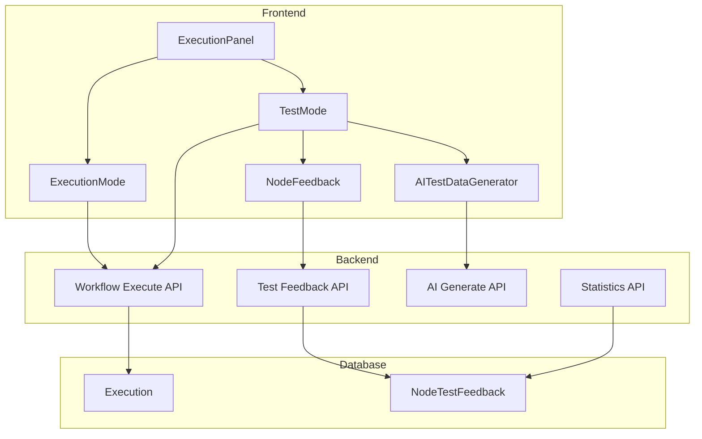

# Design Document: Workflow Test Mode

## Overview

本设计文档描述工作流执行面板的改造方案，将现有的"普通执行"和"实时监控"模式重新定义为"执行模式"和"测试模式"。

执行模式保持原有功能，支持弹窗最小化；测试模式提供完整的测试环境，支持 AI 生成测试数据、逐节点执行、节点反馈收集，并将反馈数据持久化到数据库用于统计分析。

## Architecture



## Components and Interfaces

### 1. ExecutionPanel 组件改造

现有的 `ExecutionPanel` 组件将进行以下改造：

```typescript
// 执行模式类型
type ExecutionMode = "execute" | "test";

interface ExecutionPanelProps {
  workflowId: string;
  isOpen: boolean;
  onClose: () => void;
  initialMode?: ExecutionMode;
  onNodeStatusChange?: (nodeId: string, status: NodeExecutionStatus) => void;
}
```

### 2. TestMode 组件

新增测试模式组件，负责测试数据输入、AI 生成、节点反馈收集：

```typescript
interface TestModeProps {
  workflowId: string;
  inputFields: InputField[];
  nodes: WorkflowNode[];
  onExecute: (input: Record<string, string>, isAIGenerated: boolean) => void;
  onFeedbackSubmit: (feedback: NodeFeedback) => void;
}

interface InputField {
  nodeId: string;
  nodeName: string;
  fieldId: string;
  fieldName: string;
  fieldType: InputFieldType;
  defaultValue: string;
  options?: Array<{ label: string; value: string }>;
}
```

### 3. NodeFeedback 组件

节点反馈组件，显示在每个节点执行结果下方：

```typescript
interface NodeFeedbackProps {
  nodeId: string;
  nodeName: string;
  nodeOutput: Record<string, unknown>;
  onSubmit: (feedback: NodeFeedbackData) => void;
}

interface NodeFeedbackData {
  nodeId: string;
  isCorrect: boolean;
  errorReason?: string;
  errorCategory?: ErrorCategory;
}

type ErrorCategory = 
  | "OUTPUT_FORMAT"      // 输出格式错误
  | "OUTPUT_CONTENT"     // 输出内容错误
  | "MISSING_DATA"       // 数据缺失
  | "LOGIC_ERROR"        // 逻辑错误
  | "PERFORMANCE"        // 性能问题
  | "OTHER";             // 其他
```

### 4. AITestDataGenerator 服务

AI 测试数据生成服务：

```typescript
interface AITestDataGeneratorService {
  generateTestData(
    workflowId: string,
    inputFields: InputField[]
  ): Promise<Record<string, string>>;
}

// API 请求
interface GenerateTestDataRequest {
  workflowId: string;
  fields: Array<{
    name: string;
    type: InputFieldType;
    description?: string;
    options?: Array<{ label: string; value: string }>;
  }>;
}

// API 响应
interface GenerateTestDataResponse {
  success: boolean;
  data?: Record<string, string>;
  error?: string;
}
```

## Data Models

### 1. 数据库模型扩展

在现有 `Execution` 模型基础上添加测试相关字段：

```prisma
model Execution {
  // ... 现有字段 ...
  
  // 新增字段
  executionType    ExecutionType    @default(NORMAL)
  isAIGeneratedInput Boolean        @default(false)
  
  // 关联
  nodeFeedbacks    NodeTestFeedback[]
}

enum ExecutionType {
  NORMAL    // 正常执行
  TEST      // 测试执行
}
```

### 2. 新增 NodeTestFeedback 模型

```prisma
model NodeTestFeedback {
  id            String        @id @default(cuid())
  executionId   String
  nodeId        String
  nodeName      String
  nodeType      String
  isCorrect     Boolean
  errorReason   String?       @db.Text
  errorCategory ErrorCategory?
  nodeOutput    Json?
  createdAt     DateTime      @default(now())
  updatedAt     DateTime      @updatedAt
  userId        String
  
  execution     Execution     @relation(fields: [executionId], references: [id], onDelete: Cascade)
  
  @@index([executionId])
  @@index([nodeId])
  @@index([isCorrect])
  @@index([errorCategory])
  @@index([createdAt])
  @@map("node_test_feedbacks")
}

enum ErrorCategory {
  OUTPUT_FORMAT
  OUTPUT_CONTENT
  MISSING_DATA
  LOGIC_ERROR
  PERFORMANCE
  OTHER
}
```

### 3. 统计数据模型

扩展现有的 `WorkflowAnalytics` 模型：

```prisma
model WorkflowAnalytics {
  // ... 现有字段 ...
  
  // 新增测试相关统计
  testExecutionCount    Int    @default(0)
  nodeCorrectCount      Int    @default(0)
  nodeIncorrectCount    Int    @default(0)
  errorCategoryBreakdown Json?
}
```

## API Endpoints

### 1. 测试执行 API

```typescript
// POST /api/workflows/:id/execute
interface ExecuteRequest {
  input: Record<string, string>;
  async?: boolean;
  executionType?: "NORMAL" | "TEST";  // 新增
  isAIGeneratedInput?: boolean;        // 新增
}
```

### 2. 节点反馈 API

```typescript
// POST /api/executions/:id/node-feedback
interface NodeFeedbackRequest {
  nodeId: string;
  nodeName: string;
  nodeType: string;
  isCorrect: boolean;
  errorReason?: string;
  errorCategory?: ErrorCategory;
  nodeOutput?: Record<string, unknown>;
}

// GET /api/executions/:id/node-feedbacks
interface NodeFeedbacksResponse {
  success: boolean;
  data: NodeTestFeedback[];
}
```

### 3. AI 测试数据生成 API

```typescript
// POST /api/workflows/:id/generate-test-data
interface GenerateTestDataRequest {
  fields: Array<{
    name: string;
    type: InputFieldType;
    description?: string;
    options?: Array<{ label: string; value: string }>;
  }>;
}

interface GenerateTestDataResponse {
  success: boolean;
  data?: Record<string, string>;
  error?: string;
}
```

### 4. 测试统计 API

```typescript
// GET /api/workflows/:id/test-statistics
interface TestStatisticsRequest {
  startDate?: string;
  endDate?: string;
  nodeId?: string;
}

interface TestStatisticsResponse {
  success: boolean;
  data: {
    totalTests: number;
    nodeStatistics: Array<{
      nodeId: string;
      nodeName: string;
      totalFeedbacks: number;
      correctCount: number;
      incorrectCount: number;
      correctRate: number;
      errorCategories: Record<ErrorCategory, number>;
    }>;
    errorCategoryBreakdown: Record<ErrorCategory, number>;
    trend: Array<{
      date: string;
      correctRate: number;
      testCount: number;
    }>;
  };
}
```

## Correctness Properties

*A property is a characteristic or behavior that should hold true across all valid executions of a system-essentially, a formal statement about what the system should do. Properties serve as the bridge between human-readable specifications and machine-verifiable correctness guarantees.*

### Property 1: 反馈数据完整性和持久化

*For any* 有效的节点反馈数据，保存到数据库后查询应返回包含所有必需字段（nodeId、executionId、isCorrect、errorReason、createdAt）的完整记录。

**Validates: Requirements 3.3, 3.4**

### Property 2: 测试执行记录完整性

*For any* 测试模式执行，创建的执行记录应包含 executionType=TEST、isAIGeneratedInput 标记、输入数据等元数据，且节点反馈应正确关联到该执行记录。

**Validates: Requirements 4.1, 4.2, 4.3**

### Property 3: 执行类型区分

*For any* 执行历史查询，按 executionType 筛选应只返回对应类型的执行记录，NORMAL 类型不应包含 TEST 类型记录，反之亦然。

**Validates: Requirements 4.4**

### Property 4: 多维度查询正确性

*For any* 节点反馈查询，按工作流 ID、节点 ID、时间范围筛选的结果应满足所有筛选条件。

**Validates: Requirements 4.5**

### Property 5: AI 生成数据类型正确性

*For any* 输入字段定义，AI 生成的测试数据应符合字段类型要求：文本字段返回字符串、选择字段返回有效选项值、图片字段返回有效 URL 格式。

**Validates: Requirements 5.2, 5.5**

### Property 6: 统计计算正确性

*For any* 节点反馈数据集，计算的正确率应等于 correctCount / totalCount，错误分类统计应等于各分类的实际数量，时间筛选应只包含指定范围内的数据。

**Validates: Requirements 6.2, 6.3, 6.4, 6.5**

## Error Handling

### 1. AI 生成失败处理

```typescript
try {
  const testData = await generateTestData(workflowId, fields);
  setInputValues(testData);
} catch (error) {
  toast.error("AI 生成测试数据失败，请手动输入");
  // 保持输入表单可用，允许手动输入
}
```

### 2. 反馈提交失败处理

```typescript
try {
  await submitNodeFeedback(executionId, feedback);
  toast.success("反馈已保存");
} catch (error) {
  toast.error("反馈保存失败，请重试");
  // 保留用户输入，允许重试
}
```

### 3. 测试执行失败处理

- 单个节点失败不影响其他节点的反馈收集
- 显示失败节点的错误信息
- 允许用户对失败节点也提供反馈

## Testing Strategy

### 单元测试

使用 Vitest 进行单元测试：

1. **组件测试**
   - ExecutionPanel 模式切换测试
   - NodeFeedback 组件交互测试
   - TestMode 组件状态管理测试

2. **API 测试**
   - 节点反馈 API 参数验证
   - 测试统计 API 计算逻辑
   - AI 生成 API 错误处理

### 属性测试

使用 fast-check 进行属性测试，每个属性测试运行至少 100 次迭代：

1. **Property 1**: 生成随机反馈数据，验证保存和查询的完整性
2. **Property 2**: 生成随机测试执行，验证记录完整性
3. **Property 3**: 生成混合执行记录，验证类型筛选正确性
4. **Property 4**: 生成随机查询条件，验证筛选结果正确性
5. **Property 5**: 生成随机字段定义，验证 AI 生成数据类型
6. **Property 6**: 生成随机反馈数据集，验证统计计算正确性

### 集成测试

1. 完整测试流程：输入数据 → 执行 → 反馈 → 统计
2. AI 生成 → 自动填充 → 执行流程
3. 统计分析页面数据展示

